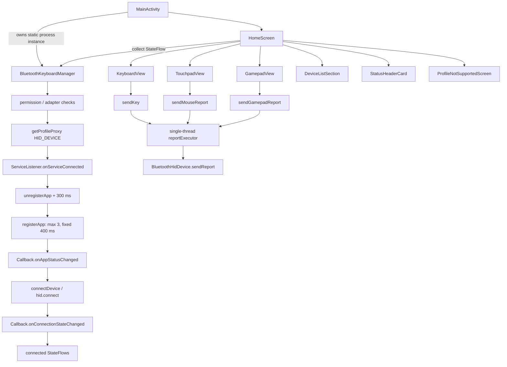

# Bluke Android platform audit

Audit date: 2026-09-15/16 (Asia/Calcutta)  
Audited revision: `ec01041` (`main`)  
Working branch: `refactor`

## 1. Executive summary

- **P0 — HID lifecycle is not modeled as a state machine.** Registration, proxy binding, and connection are coordinated by booleans, fixed delays, and a single pending-device slot.
- **P0 — A connect can proceed after registration wait times out.** The return from `withTimeoutOrNull(3000)` is ignored, so `hid.connect()` runs while registration is still false.
- **P0 — dead-process SDP recovery is timing-based.** Current code unregisters, waits 300 ms, then retries registration three times at fixed 400 ms intervals; callback completion is not the retry gate.
- **P1 — hidden Bluetooth APIs are unreliable.** A2DP/HFP `disconnect(BluetoothDevice)` is invoked reflectively, while `setBluetoothClass(Int)` does not match the platform method signature and is effectively a no-op.
- **P1 — lifecycle cleanup is incomplete.** The HID proxy and receivers are closed on a finishing `MainActivity`, but coroutine/executor threads remain alive; `cleanup()` does not close the proxy.
- **P1 — gamepad cadence differs from the intended 125 Hz.** The immediate gate is 8 ms but the dirty-state ticker is 10 ms, and forced button reports bypass the gate.
- **P1 — gamepad layout gestures write SharedPreferences on every movement/scale event** and state changes recompose a very large composable tree.
- **P1 — UI state is composable-local.** There are no ViewModels; `HomeScreen` owns persisted settings, transient UI state, lifecycle effects, and Bluetooth presentation logic.
- **P2 — dependency alignment is mixed.** Material3 `1.4.0-alpha04` overrides the BOM and selects Compose runtime `1.8.0-alpha06` while most Compose artifacts resolve to `1.7.8`.
- **P2 — lint found nine unused resources and four icon packaging/density findings.** These were documented, not removed, because dynamic/OEM/resource validation is still needed.
- Baseline: `assembleDebug` passed; lint reported 2 errors and 42 warnings; 3 local tests passed and zero exercise Bluetooth/HID.
- After low-risk changes: `assembleDebug` and `lintDebug` pass; lint reports 0 errors and 40 warnings.
- No SDK, AGP, Kotlin, Compose BOM, signing, Fastlane, or F-Droid changes were made; no dependency was added.

## 2. Repository reconnaissance

### 2.1 File tree (`app/src/main` plus Gradle files)

The full `tree /F app\src\main` command was executed. Audio asset filenames are repetitive, so this checked-in report collapses only those directories; no source/resource entries are omitted.

```text
app/src/main/
├── AndroidManifest.xml
├── assets/audio/
│   ├── alpaca/{press,release}/*.mp3
│   ├── blackink/{press,release}/*.mp3
│   ├── bluealps/{press,release}/*.mp3
│   ├── boxnavy/{press,release}/*.mp3
│   ├── buckling/{press,release}/*.mp3
│   ├── cream/{press,release}/*.mp3
│   ├── holypanda/{press,release}/*.mp3
│   ├── mxblack/{press,release}/*.mp3
│   ├── mxblue/{press,release}/*.mp3
│   ├── mxbrown/{press,release}/*.mp3
│   ├── redink/{press,release}/*.mp3
│   ├── topre/{press,release}/*.mp3
│   └── turquoise/{press,release}/*.mp3
├── java/dev/arnv/bluke/
│   ├── AboutActivity.kt
│   ├── BehaviorActivity.kt
│   ├── DarkThemeActivity.kt
│   ├── DeveloperLogsActivity.kt
│   ├── DeveloperOptionsActivity.kt
│   ├── HelpActivity.kt
│   ├── LicensesActivity.kt
│   ├── LookAndFeelActivity.kt
│   ├── MainActivity.kt
│   ├── OnboardingActivity.kt
│   ├── SettingsActivity.kt
│   ├── bluetooth/BluetoothKeyboardManager.kt
│   ├── sound/KeyboardSoundSynthesizer.kt
│   ├── utils/DeveloperLogManager.kt
│   └── ui/
│       ├── DeviceRow.kt
│       ├── GamepadView.kt
│       ├── HomeScreen.kt
│       ├── KeyboardLayouts.kt
│       ├── KeyboardView.kt
│       ├── KeyCap.kt
│       ├── SettingsComponents.kt
│       ├── TouchpadView.kt
│       └── theme/{Color,Theme,ThemeConfig,Type}.kt
└── res/
    ├── drawable/{ic_dialpad_off,ic_dpad,ic_github,ic_launcher_foreground,ic_launcher_monochrome,ic_vibration_off,ic_wordmark}.xml
    ├── drawable/{ic_launcher_background,skin_0}.png
    ├── mipmap-anydpi-v26/{ic_launcher,ic_launcher_round}.xml
    ├── mipmap-{mdpi,hdpi,xhdpi,xxhdpi,xxxhdpi}/{ic_launcher,ic_launcher_round}.webp
    ├── values/{colors,strings,themes}.xml
    ├── values-night/themes.xml
    └── xml/{backup_rules,data_extraction_rules}.xml

build.gradle.kts
settings.gradle.kts
gradle.properties
gradle/libs.versions.toml
app/build.gradle.kts
```

The refactor adds `DeviceListSection.kt`, `StatusHeaderCard.kt`, `ProfileNotSupportedScreen.kt`, `values-v31/themes.xml`, and `values-night-v31/themes.xml`.

### 2.2 Kotlin inventory at `main` HEAD

| Lines | Path | Responsibility | Size flag |
|---:|---|---|---|
| 362 | `AboutActivity.kt` | About page, version/social actions, developer-mode unlock. | — |
| 1,022 | `BehaviorActivity.kt` | Behavior preferences for layouts, sounds, modes, and colors. | **CRITICAL** |
| 141 | `DarkThemeActivity.kt` | Dark-theme preference UI. | — |
| 179 | `DeveloperLogsActivity.kt` | Developer log viewer, filtering, and auto-save toggle. | — |
| 241 | `DeveloperOptionsActivity.kt` | Developer flags and mock-state controls. | — |
| 216 | `HelpActivity.kt` | Usage instructions and help sections. | — |
| 354 | `LicensesActivity.kt` | Third-party license data and searchable license UI. | — |
| 306 | `LookAndFeelActivity.kt` | Appearance and visual preference UI. | — |
| 103 | `MainActivity.kt` | App entry point, permissions, manager ownership, Compose root. | — |
| 450 | `OnboardingActivity.kt` | Paged onboarding, permissions, and connection guide. | Refactor candidate |
| 121 | `SettingsActivity.kt` | Settings navigation and lifecycle refresh. | — |
| 1,207 | `bluetooth/BluetoothKeyboardManager.kt` | Bluetooth HID capability, registration, connection, reports, receivers. | **CRITICAL** |
| 502 | `sound/KeyboardSoundSynthesizer.kt` | Low-latency keyboard switch audio loading and playback. | Refactor candidate |
| 100 | `utils/DeveloperLogManager.kt` | In-memory developer log state and optional file persistence. | — |
| 333 | `ui/DeviceRow.kt` | Device classification and Bluetooth-device row UI. | — |
| 2,710 | `ui/GamepadView.kt` | Gamepad UI, touch handling, editor, and report scheduling. | **CRITICAL** |
| 1,393 | `ui/HomeScreen.kt` | Home/config screen, mode navigation, settings/state, device lists. | **CRITICAL** |
| 650 | `ui/KeyboardLayouts.kt` | Keyboard/case models, palettes, and layout definitions. | Refactor candidate |
| 185 | `ui/KeyboardView.kt` | Keyboard surface and key layout rendering. | — |
| 153 | `ui/KeyCap.kt` | Individual key rendering and press behavior. | — |
| 157 | `ui/SettingsComponents.kt` | Shared settings cards, groups, and rows. | — |
| 1,072 | `ui/TouchpadView.kt` | Touchpad gestures, mouse reporting, buttons, and numpad overlay. | **CRITICAL** |
| 11 | `ui/theme/Color.kt` | Base theme colors. | — |
| 144 | `ui/theme/Theme.kt` | Material theme selection and system-bar styling. | — |
| 37 | `ui/theme/ThemeConfig.kt` | Theme shape helpers. | — |
| 36 | `ui/theme/Type.kt` | Typography definition. | — |

After extraction, `HomeScreen.kt` is 1,026 lines; the new files are `DeviceListSection.kt` (204), `StatusHeaderCard.kt` (144), and `ProfileNotSupportedScreen.kt` (99). `HomeScreen.kt` remains critical and needs state-hoisting work.

### 2.3 Build configuration

| Setting | Observed value |
|---|---|
| min / target / compile SDK | 28 / 36 / `release(36) { minorApiLevel = 1 }` |
| AGP | 9.2.1 |
| Kotlin + Compose compiler plugin | 2.2.10 (`org.jetbrains.kotlin.plugin.compose`; compiler version follows Kotlin plugin) |
| Java / Kotlin JVM target | 17 / JVM 17 |
| Compose BOM | 2025.02.00 |
| Material3 override | 1.4.0-alpha04 |
| Version catalog | Yes: `gradle/libs.versions.toml`; coordinates are catalogued except plugin-management/toolchain literals. |
| Flavors | None |
| Debug build type | Defaults; no minification/resource shrinking configuration. |
| Release build type | `isMinifyEnabled=true`, `isShrinkResources=true`, PNG crunching, release signing config. |
| R8/ProGuard | `proguard-android-optimize.txt` + `app/proguard-rules.pro`; custom rules strip `Log.v`/`Log.d`. |
| Build cache | `org.gradle.caching=true`; dependency/test output showed `FROM-CACHE`. |
| Configuration cache | `org.gradle.configuration-cache=true`; dry-run succeeded and later builds reused the cache. |

No version was changed during this audit.

### 2.4 Manifest audit

| Permission | Exercised? | Evidence/assessment |
|---|---|---|
| `BLUETOOTH` | Yes on API 28–30 | Legacy permission for adapter/profile/device operations. |
| `BLUETOOTH_ADMIN` | Yes on API 28–30 | Discovery control and bonding paths use privileged legacy Bluetooth operations. |
| `BLUETOOTH_CONNECT` | Yes | Adapter name/state, bonded devices, device fields/bonding, profile binding, HID registration/connect/disconnect/report calls. Requested at runtime on API 31+. |
| `BLUETOOTH_SCAN` | Yes | `startDiscovery`, `cancelDiscovery`, discovery broadcasts. Requested at runtime; manifest uses `neverForLocation`. |
| `BLUETOOTH_ADVERTISE` | **No distinct call site found** | It is checked/requested, but `BluetoothHidDevice.registerApp` is documented as requiring `BLUETOOTH_CONNECT`, not `BLUETOOTH_ADVERTISE`. Candidate for device-tested removal, not changed here. |
| `ACCESS_FINE_LOCATION` | Yes on API 28–30 | Runtime gate for classic discovery. The code accepts fine **or coarse**; on Android 10/11, accepting coarse alone may be insufficient. |
| `ACCESS_COARSE_LOCATION` | Partially/legacy | Requested and accepted as an alternative to fine. Review per API 28–30 behavior before removal. |
| `VIBRATE` | Yes | Gamepad haptics use `Vibrator`/`VibrationEffect`. |

There are no `<uses-feature>` declarations. There are no services, foreground-service types, providers, or receivers in the manifest. `MainActivity` is the only exported component and is exported for its launcher intent filter; the other nine activities have no filters and default to unexported. Dynamic Bluetooth receivers are discussed below.

## 3. Architecture map



Compose/state graph:

```text
MainActivity
└── HomeScreen (no ViewModel)
    ├── Bluetooth StateFlows collected directly
    ├── remember/rememberSaveable UI and preference mirrors
    ├── lifecycle observer reloads SharedPreferences
    ├── config mode
    │   ├── StatusHeaderCard
    │   ├── DeviceListSection -> DeviceRow
    │   └── ProfileNotSupportedScreen
    └── active mode
        ├── KeyboardView -> KeyCap
        ├── TouchpadView
        └── GamepadView (also owns editor/report state)

SettingsActivity -> separate Activity screens (Behavior, LookAndFeel, DarkTheme,
About, Help, Licenses, DeveloperOptions, DeveloperLogs); persistence is SharedPreferences.
```

There are no ViewModel subclasses or `viewModel()` call sites. State lives in `BluetoothKeyboardManager` `MutableStateFlow`s, composable `remember`/`rememberSaveable` state, and multiple SharedPreferences files.

### Threading inventory

- Compose event handlers, `LaunchedEffect`, and `DisposableEffect` run on the main dispatcher unless their context is changed; no explicit `Dispatchers.Main` call exists.
- `BluetoothKeyboardManager.managerScope = CoroutineScope(Dispatchers.IO + Job())` runs capability binding, registration, connect/disconnect waits, retries, and audio-profile sweeps. It is unscoped to Android lifecycle; `close()` does not cancel it.
- `DeveloperLogManager.scope = CoroutineScope(Dispatchers.IO)` is unscoped, has no retained `Job`, and is never cancelled.
- `reportExecutor` is a single foreground-priority thread. Every `sendReport()` call is submitted to it; no HID report is sent directly on the main thread.
- `executor` is a single background-priority scheduled executor used for HID callbacks and connection timeout tasks.
- No explicit `Dispatchers.Default`, `GlobalScope`, or `runBlocking` usage exists.

## 4. Executed tooling and build health

All commands were run against this checkout. On Windows, `gradlew.bat` is the wrapper equivalent of the requested `./gradlew` commands.

The host initially set Gradle's cache to an unwritable root directory:

```text
> .\gradlew.bat --version
Exception in thread "main" java.lang.RuntimeException: Could not create parent directory for lock file C:\.gradle\wrapper\dists\gradle-9.5.1-bin\...\gradle-9.5.1-bin.zip.lck
exit_code=1
```

Using a repository-local `GRADLE_USER_HOME` made Gradle runnable:

```text
Gradle 9.5.1
Kotlin:        2.3.20
Launcher JVM:  21.0.7 (Oracle Corporation 21.0.7+8-LTS-245)
OS:            Windows 11 10.0 amd64
exit_code=0
```

The sandbox then denied Java zip-filesystem access to Gradle's own JAR. Re-running the Gradle wrapper with the approved Gradle-only sandbox exception succeeded:

```text
> .\gradlew.bat clean --stacktrace
Caused by: java.nio.file.AccessDeniedException: ...\gradle-base-services-9.5.1.jar
BUILD FAILED

> .\gradlew.bat clean --stacktrace   # approved Gradle-only exception
> Task :app:clean UP-TO-DATE
BUILD SUCCESSFUL in 2m 22s
1 actionable task: 1 up-to-date
Configuration cache entry stored.
```

Baseline build:

```text
> .\gradlew.bat assembleDebug --warning-mode all --stacktrace
> Task :app:stripDebugDebugSymbols
Unable to strip the following libraries, packaging them as they are: libandroidx.graphics.path.so.
> Task :app:assembleDebug
BUILD SUCCESSFUL in 8m 44s
38 actionable tasks: 38 executed
Configuration cache entry stored.
```

No Kotlin compiler warnings, Gradle deprecation warnings, or `Deprecated Gradle features were used` notice appeared. The native strip warning above was the only baseline build warning.

Configuration-cache dry run:

```text
> .\gradlew.bat assembleDebug --configuration-cache --dry-run
Calculating task graph as configuration cache cannot be reused because ...android-36.1\package.xml has been created.
:app:assembleDebug SKIPPED
BUILD SUCCESSFUL in 5s
Configuration cache entry stored.
```

The one-time cache miss was caused by installation of Android SDK Platform 36.1 during the preceding build. Subsequent builds printed `Reusing configuration cache.` Build-cache compatibility is supported by observed `FROM-CACHE` tasks and `org.gradle.caching=true`.

Baseline lint commands:

```text
> .\gradlew.bat lint
Wrote HTML report to .../app/build/reports/lint-results-debug.html
Lint found 2 errors and 42 warnings. First failure:
...\values-night\themes.xml:4: Error: android:windowSplashScreenBackground requires API level 31 (current min is 28) [NewApi]
BUILD FAILED in 5m 15s

> .\gradlew.bat lintDebug
Lint found 2 errors, 42 warnings. First failure: [NewApi]
BUILD FAILED in 14s

> .\gradlew.bat lintRelease
Wrote HTML report to .../app/build/reports/lint-results-release.html
Lint found 2 errors and 42 warnings. First failure: [NewApi]
BUILD FAILED in 4m 24s
```

Lint was not muted and already emitted text, XML, and HTML, so no temporary lint configuration commit was needed. Reports are present at `app/build/reports/lint-results-{debug,release}.{txt,xml,html}`. SARIF is not generated by the project's default lint configuration.

After the mechanical fixes:

```text
> .\gradlew.bat assembleDebug
BUILD SUCCESSFUL in 4s
38 actionable tasks: 38 up-to-date
Configuration cache entry reused.

> .\gradlew.bat lintDebug
Wrote HTML report to .../app/build/reports/lint-results-debug.html
BUILD SUCCESSFUL in 2m 26s
29 actionable tasks: 9 executed, 20 up-to-date
Configuration cache entry reused.

# lint-results-debug.txt
0 errors, 40 warnings
```

### 4.1 Full baseline lint table

Each row below is one `<issue>` from the executed baseline `lint-results-debug.xml`. Debug and release contained the same 44 findings.

| Issue ID | Severity | File:line | Category | Explanation | Proposed fix | Fix risk |
|---|---|---|---|---|---|---|
| NewApi | Error | `values-night/themes.xml:4` | Correctness | API-31 splash attribute in API-28 resource. | Move to `values-night-v31` (done). | Low |
| NewApi | Error | `values/themes.xml:5` | Correctness | API-31 splash attribute in API-28 resource. | Move to `values-v31` (done). | Low |
| OldTargetApi | Warning | `app/build.gradle.kts:18` | Correctness | Lint sees API 37 while target is 36. | Upgrade only in a separately tested platform pass. | High |
| RedundantLabel | Warning | `AndroidManifest.xml:26` | Correctness | Main activity repeats application label. | Remove label (done). | Low |
| AndroidGradlePluginVersion | Warning | `libs.versions.toml:2` | Correctness | AGP 9.4.0 reported available. | Deferred by scope constraint. | High |
| GradleDependency | Warning | `app/build.gradle.kts:13` | Correctness | compileSdk 37 reported available. | Deferred by scope constraint. | High |
| GradleDependency | Warning | `libs.versions.toml:3` | Correctness | core-ktx 1.19.0 reported available. | Batch dependency update with regression tests. | Medium |
| GradleDependency | Warning | `libs.versions.toml:7` | Correctness | lifecycle-runtime-ktx 2.11.0 available. | Align lifecycle family together. | Medium |
| GradleDependency | Warning | `libs.versions.toml:8` | Correctness | lifecycle-viewmodel-compose 2.11.0 available. | Remove if unused; otherwise align. | Low/medium |
| GradleDependency | Warning | `libs.versions.toml:9` | Correctness | lifecycle-runtime-compose 2.11.0 available. | Align lifecycle family together. | Medium |
| GradleDependency | Warning | `libs.versions.toml:10` | Correctness | activity-compose 1.13.0 available. | Upgrade in dependency pass. | Medium |
| GradleDependency | Warning | `libs.versions.toml:12` | Correctness | Compose BOM 2026.09.00 available. | Deferred by scope constraint. | High |
| GradleDependency | Warning | `libs.versions.toml:17` | Correctness | androidx.test core 1.7.0 available. | Upgrade test stack together. | Low |
| GradleDependency | Warning | `libs.versions.toml:18` | Correctness | test runner 1.7.0 available. | Upgrade test stack together. | Low |
| GradleDependency | Warning | `libs.versions.toml:39` | Correctness | Material3 stable 1.4.0 available. | Remove alpha override / realign BOM. | Medium |
| NewerVersionAvailable | Warning | `libs.versions.toml:11` | Correctness | Kotlin Compose plugin 2.4.20 available. | Deferred by scope constraint. | High |
| NewerVersionAvailable | Warning | `libs.versions.toml:14` | Correctness | coroutines-android 1.11.0 available. | Align coroutine family. | Medium |
| NewerVersionAvailable | Warning | `libs.versions.toml:15` | Correctness | coroutines-core 1.11.0 available. | Remove redundant direct core or align. | Low/medium |
| NewerVersionAvailable | Warning | `libs.versions.toml:16` | Correctness | coroutines-test 1.11.0 available. | Align coroutine family. | Low |
| NewerVersionAvailable | Warning | `libs.versions.toml:19` | Correctness | Robolectric 4.17 available. | Upgrade test stack separately. | Low/medium |
| NewerVersionAvailable | Warning | `libs.versions.toml:20` | Correctness | Roborazzi plugin/catalog version 1.74.0 available. | Upgrade test tooling separately. | Medium |
| NewerVersionAvailable | Warning | `libs.versions.toml:20` | Correctness | Roborazzi core 1.74.0 available. | Same aligned upgrade. | Medium |
| NewerVersionAvailable | Warning | `libs.versions.toml:20` | Correctness | Roborazzi Compose 1.74.0 available. | Same aligned upgrade. | Medium |
| NewerVersionAvailable | Warning | `libs.versions.toml:20` | Correctness | Roborazzi JUnit rule 1.74.0 available. | Same aligned upgrade. | Medium |
| ObsoleteSdkInt | Warning | `BluetoothKeyboardManager.kt:655` | Performance | API `< 28` guard is unreachable at minSdk 28. | Remove guard (done). | Low |
| ObsoleteSdkInt | Warning | `res/mipmap-anydpi-v26` | Performance | v26 qualifier is below minSdk. | Move adaptive XML to `mipmap-anydpi` after launcher validation. | Low/medium |
| UnusedResources | Warning | `colors.xml:3` | Performance | `purple_200` unused. | Remove after dynamic-reference check. | Low |
| UnusedResources | Warning | `colors.xml:4` | Performance | `purple_500` unused. | Remove after dynamic-reference check. | Low |
| UnusedResources | Warning | `colors.xml:5` | Performance | `purple_700` unused. | Remove after dynamic-reference check. | Low |
| UnusedResources | Warning | `colors.xml:6` | Performance | `teal_200` unused. | Remove after dynamic-reference check. | Low |
| UnusedResources | Warning | `colors.xml:7` | Performance | `teal_700` unused. | Remove after dynamic-reference check. | Low |
| UnusedResources | Warning | `colors.xml:8` | Performance | `black` unused. | Remove after dynamic-reference check. | Low |
| UnusedResources | Warning | `colors.xml:9` | Performance | `white` unused. | Remove after dynamic-reference check. | Low |
| UnusedResources | Warning | `drawable/ic_dpad.xml:1` | Performance | D-pad drawable unused. | Remove after UI/device screenshot review. | Low |
| UnusedResources | Warning | `drawable/skin_0.png` | Performance | Skin bitmap unused. | Remove after dynamic-reference check. | Low |
| IconDipSize | Warning | `mipmap-xhdpi/ic_launcher.webp` | Usability:Icons | Lint reports wildly inconsistent xxhdpi decoded dimensions. | Re-export/validate all launcher WebPs. | Medium |
| IconDipSize | Warning | `mipmap-xhdpi/ic_launcher_round.webp` | Usability:Icons | Lint reports wildly inconsistent xx/xxxhdpi decoded dimensions. | Re-export/validate all round icons. | Medium |
| IconLocation | Warning | `drawable/ic_launcher_background.png` | Usability:Icons | Bitmap is in densityless `drawable`. | Move to appropriate density or `drawable-nodpi`. | Medium |
| IconLocation | Warning | `drawable/skin_0.png` | Usability:Icons | Bitmap is in densityless `drawable`. | Remove if unused or move to `drawable-nodpi`. | Low |
| UseKtx | Warning | `AboutActivity.kt:111` | Productivity | Manual SharedPreferences editor chain. | Use `edit {}` extension. | Low |
| UseKtx | Warning | `DeveloperLogsActivity.kt:132` | Productivity | Manual SharedPreferences editor chain. | Use `edit {}` extension. | Low |
| UseKtx | Warning | `DeveloperOptionsActivity.kt:119` | Productivity | Manual SharedPreferences editor chain. | Use `edit {}` extension. | Low |
| UseKtx | Warning | `DeveloperOptionsActivity.kt:152` | Productivity | Manual SharedPreferences editor chain. | Use `edit {}` extension. | Low |
| UseKtx | Warning | `DeveloperOptionsActivity.kt:201` | Productivity | Manual SharedPreferences editor chain. | Use `edit {}` extension. | Low |

Special-category result: lint emitted no `InlinedApi`, `MissingPermission`, `PrivateApi`, `DiscouragedPrivateApi`, `BlockedPrivateApi`, `SoonBlockedPrivateApi`, `IconDensities`, `Overdraw`, `VectorPath`, Compose correctness/performance IDs, foreground-service/exported-receiver IDs, `StringFormatInvalid`, `MissingTranslation`, or `HardcodedText`. This is **not** proof of safety: `@SuppressLint("MissingPermission")` is broad throughout Bluetooth/UI code, and reflection hides private-API targets from static lint.

### 4.2 Additional analysis

Neither detekt nor ktlint is configured; per scope, neither was added. Proposed configuration (version availability should be rechecked when adopted):

```kotlin
// root build.gradle.kts
plugins {
    id("io.gitlab.arturbosch.detekt") version "1.23.8" apply false
}

// app/build.gradle.kts
plugins { id("io.gitlab.arturbosch.detekt") }
detekt {
    buildUponDefaultConfig = true
    allRules = false
    config.setFrom(rootProject.files("config/detekt/detekt.yml"))
    baseline = file("config/detekt/baseline.xml")
}
tasks.withType<io.gitlab.arturbosch.detekt.Detekt>().configureEach {
    jvmTarget = "17"
    reports { html.required.set(true); sarif.required.set(true) }
}
```

ASSUMPTION: Detekt `1.23.8` is used as a conservative proposed pin; verify current plugin compatibility with Kotlin 2.2/Gradle 9 before landing it.

Dependency command:

```text
> .\gradlew.bat :app:dependencies --configuration releaseRuntimeClasspath
releaseRuntimeClasspath - Runtime classpath of '/release'.
+--- androidx.compose:compose-bom:2025.02.00
|    +--- androidx.compose.material3:material3:1.3.1 -> 1.4.0-alpha04 (c)
|    +--- androidx.compose.runtime:runtime:1.7.8 -> 1.8.0-alpha06 (c)
...
+--- androidx.compose.material3:material3:1.4.0-alpha04
...
BUILD SUCCESSFUL in 6s
1 actionable task: 1 executed
```

Gradle resolves duplicate/version requests to single selected modules, so no duplicate class conflict was reported. The meaningful conflicts are the Material3-driven runtime alpha override, collection `1.5.0-alpha06`, and normal convergence of older transitive Kotlin/coroutines/lifecycle versions to direct pins. `kotlinx-coroutines-core` is redundant because `kotlinx-coroutines-android` already brings core. `lifecycle-viewmodel-compose` has no `viewModel()` use. KSP is applied with no processors (`kspDebugKotlin SKIPPED`). Material Icons Extended is large and should be audited because it is used only as an icon source, but replacing it would be feature/UI work.

Unit-test command:

```text
> .\gradlew.bat testDebugUnitTest
> Task :app:testDebugUnitTest
> Task :app:finalizeTestRoborazziDebug SKIPPED
BUILD SUCCESSFUL in 2m 4s
30 actionable tasks: 7 executed, 1 from cache, 22 up-to-date
```

JUnit XML records 3 tests, 0 failures, 0 errors, 0 skipped. No coverage plugin/report is configured. There are zero Bluetooth/HID test classes or test references, so effective Bluetooth/HID behavioral coverage is **0%** even though a numeric instruction-coverage percentage was not generated.

## 5. Targeted issue audit

### 5.1 Bluetooth lifecycle and state

| Area | Current implementation | Concrete defect | Proposed design | Files touched | Risk |
|---|---|---|---|---|---|
| Dead-process SDP registration | `registerApp()` calls `unregisterApp()`, delays 300 ms, then makes 3 `registerApp()` calls with fixed 400 ms waits. | Return `true` means the command was sent, not that callback registration completed. Fixed retry timing can overlap native cleanup and lacks jitter. Prompt said 250 ms; audited code is 300 ms. | Callback-driven `Idle → BindingProxy → Registering → Registered → Connecting → Connected → Error`; exponential backoff with jitter (for example 300/600/1200 ms ±20%), named max attempts, and callback/timeout generation IDs to ignore stale callbacks. | Proposed: Bluetooth manager split plus new capability/repository classes. No behavior change landed. | High; OEM Bluetooth stacks vary. |
| Async proxy binding | `getProfileProxy()` is retried; a nullable single `pendingConnectAfterRestart` stores one request. | No mutex/single flight; repeated capability checks can bind concurrently. A second request overwrites the first. A coroutine captures a stale `hid` proxy. | `Mutex` around bind/register; `Channel<ConnectRequest>(capacity = Channel.UNLIMITED)` or explicitly conflated `SharedFlow` if latest-wins is desired. Drain only in Registered state. | Proposed Bluetooth repository/coordinator. | Medium/high. |
| Registration timeout / OEM missing callback | There is no 8-second registration watchdog in current HEAD. `connectDevice` waits up to 3 seconds for `appRegistrationState.first { it }`, ignores timeout result, then calls `connect`. | Missing callback leaves state ambiguous; connection proceeds unregistered. Capability and transient registration failure both become UI profile errors/status strings. | `BluetoothCapabilityRepository.capability(): Flow<Capability>`; named `APP_REGISTRATION_TIMEOUT_MS = 8_000L` (longer than observed 200–2,000 ms binding plus stack variance), cold flow per probe, and separate Unsupported / Timeout / Permission / StackError results. | Proposed new repository; no UI coupling. | Medium. |
| Audio interference | Three sweeps at 0.5/2.0/3.5 s acquire A2DP and Headset proxies, reflect `disconnect(BluetoothDevice)`, then close each callback proxy. | `disconnect` is hidden/system API; reflection can be blocked or require privileged permissions. Three repeated binds are expensive. | Keep public `getProfileProxy`/`closeProfileProxy`; do not promise disconnect from a third-party app. Prefer user-visible profile guidance or an explicit best-effort adapter isolated behind capability checks. | `BluetoothKeyboardManager.kt` proposed. | High; behavior and platform policy. |
| Proxy lifecycle | HID proxy is closed in `close()` only when `MainActivity.isFinishing`; A2DP/HFP callback proxies close in `finally`. | `cleanup()` does not unregister HID app/close proxy. `close()` does not cancel `managerScope` or shut down either executor. `onServiceDisconnected` says “Rebinding” but does not initiate a bind. | One idempotent `close()` that cancels scope, cancels timeout, unregisters app/receivers, closes all acquired proxies, and shuts down executors; lifecycle owner should be process/service scoped. | Proposed. Existing proxy closure was already present, so no duplicate fix landed. | Medium. |
| Receivers | Bond/state receiver registered at init; discovery receiver registered on first scan. Both are unregistered in `close()` and `cleanup()` under flags. API 33+ uses `RECEIVER_EXPORTED`. | Registration/unregistration is symmetric. `EXPORTED` expands exposure but can be necessary for highly privileged Bluetooth-system broadcasts; changing it blindly may break OEM delivery. | Keep explicit flags; validate `RECEIVER_NOT_EXPORTED` on target devices before tightening. Make close idempotent and central. | No change. | Medium. |

Hidden API targets:

- `proxy.javaClass.getMethod("disconnect", BluetoothDevice::class.java)` resolves to `BluetoothA2dp.disconnect(BluetoothDevice)` and `BluetoothHeadset.disconnect(BluetoothDevice)`. AOSP marks these `@hide`/`@SystemApi`; Headset also has system/telephony permission history. Android's non-SDK policy treats test APIs as blocked from Android 11 and allows OEMs to add restrictions. Static lint misses these because the owner class is dynamic.
- `BluetoothAdapter::class.java.getDeclaredMethod("setBluetoothClass", Int.TYPE)` targets a signature that does not exist in audited AOSP (`setBluetoothClass(BluetoothClass)` is the hidden signature and requires `BLUETOOTH_PRIVILEGED`). Therefore the current Int reflection should consistently throw `NoSuchMethodException`; even a corrected signature would not be available to a normal third-party app.
- Current policy/source references: [Android non-SDK restrictions](https://developer.android.com/guide/app-compatibility/restrictions-non-sdk-interfaces), [AOSP BluetoothA2dp](https://android.googlesource.com/platform/packages/modules/Bluetooth/+/57b823f4f7/framework/java/android/bluetooth/BluetoothA2dp.java), [AOSP BluetoothHeadset](https://android.googlesource.com/platform/packages/modules/Bluetooth/+/57b823f4f7/framework/java/android/bluetooth/BluetoothHeadset.java), and [AOSP BluetoothAdapter](https://android.googlesource.com/platform/packages/modules/Bluetooth/+/9025756b0e/framework/java/android/bluetooth/BluetoothAdapter.java).

ASSUMPTION: Exact hidden-API flags can differ on OEM Android 16 images; this audit verified AOSP policy/source, not runtime `hidden_api_policy` logcat on physical Motorola/Tecno/LG devices.

### 5.2 HID report pipeline

- One 183-byte composite descriptor is a property-level `byteArrayOf` literal in `BluetoothKeyboardManager.kt`; it is assembled at instance construction from byte literals (not loaded from resources or generated conditionally). It contains keyboard report ID 1, mouse report ID 2, and gamepad report ID 3. The mutable `ByteArray` reference is private and not modified after construction.
- SDP settings are: name `Bluke`, description `Wireless Controller Combo`, provider `Bluke`, subclass `BluetoothHidDevice.SUBCLASS1_COMBO` = `0xC0` / signed byte `-64`, descriptor above. All three QoS arguments are `null`.
- The only framework `sendReport()` call is `submitReport()` line 65 at baseline. `sendKey`, `sendMouseReport`, and `sendGamepadReport` construct 8-, 4-, and 11-byte payloads and enqueue them to one `reportExecutor`.
- The single-thread executor preserves enqueue order and does not intentionally drop reports. It is unbounded, so bursts can accumulate stale motion reports and increase latency. Exceptions drop only the failed report. Connection callback events use a separate `MutableSharedFlow` with `DROP_OLDEST`, but that is not the HID payload queue.
- No framework report is sent on the main thread. Payload construction and gamepad state mutation occur on the Compose/main thread, followed by executor submission.
- Gamepad immediate motion reports are gated by `>= 8L`, but dirty state is flushed every `10L.milliseconds`; forced press/release reports bypass the gate. A refactor should sample latest state on a strict 8 ms ticker, send transition edges without reordering, and make backpressure semantics explicit.
- Descriptor semantics were not changed.

### 5.3 Compose UI and performance

| Area | Current implementation | Defect | Proposed design | Files | Risk |
|---|---|---|---|---|---|
| Gamepad recomposition | Stick/D-pad/editor state is held near the `GamepadView` root. Stick visuals already use lambda `Modifier.offset {}` and `rememberUpdatedState` in key low-level components. | Root-owned state still invalidates broad portions of a 2,710-line tree. D-pad rotation reads composition state. | Split stable controller state; defer position reads to `offset {}`/`graphicsLayer`; use `rememberUpdatedState` for gesture callbacks; isolate each control. | `GamepadView.kt` | Medium. |
| Report cadence | 8 ms event gate + 10 ms dirty ticker. | Not pinned at 125 Hz and touch frequency still influences immediate sends. | One 8 ms ticker samples latest atomic/snapshot state; touch only mutates state; preserve edge reports deliberately. | `GamepadView.kt`, report scheduler tests | Medium/high. |
| Home screen | One composable held 1,393 lines and all state. This pass extracted three requested visual sections, leaving 1,026 lines. | No `HomeUiState`/ViewModel; duplicated Flow collection and preference mirroring; business/presentation coupling. | Introduce immutable `HomeUiState`, reducer/ViewModel, lifecycle-aware collection, then split active-mode host and launch controls. | `HomeScreen.kt` plus new state/ViewModel files | Medium. |
| Layout persistence | `saveLayoutPref` calls SharedPreferences `apply()` on every pan/zoom callback. | Excess editor allocation/disk scheduling and jank risk during gesture. | `LayoutRepository` backed by DataStore; in-memory edits during gesture, debounce/batch and commit on gesture end. | `GamepadView.kt`, new repository | Medium; migration needed. |

Effect/key audit:

| Location | Effect/key | Finding |
|---|---|---|
| `HelpActivity.kt:40` | `LaunchedEffect(timer)` | Scalar key is stable; effect intentionally restarts with timer changes. |
| `DeveloperOptionsActivity.kt:48` | `LaunchedEffect(catClicked)` | Stable scalar key. |
| `DeveloperLogsActivity.kt:62` | `LaunchedEffect(filteredLogs.size)` | Stable key, but same-size content replacement will not trigger scroll. |
| `OnboardingActivity.kt:138,148` | Two `LaunchedEffect(pagerState.currentPage)` | Stable key; duplicated effects should be combined to avoid ordering ambiguity. |
| `HomeScreen.kt:147` | `LaunchedEffect(Unit)` | One-shot is intentional; it captures `sharedPrefs`, which is remembered without a `context` key. |
| `HomeScreen.kt:207` | connection/LED/mode tuple | Primitive/string keys are stable and complete for the body. |
| `HomeScreen.kt:218` | `LaunchedEffect(btState)` | Sealed state values are stable enough; connected data class changes on name. |
| `HomeScreen.kt:227` | `LaunchedEffect(btMessage)` | Stable string key; repeated identical errors do not toast again. |
| `HomeScreen.kt:240` | `LaunchedEffect(isKeyboardActive)` | Stable Boolean key; context/window is captured but not keyed. |
| `GamepadView.kt:368` | `LaunchedEffect(Unit)` | Long-lived ticker captures `btManager`; use `rememberUpdatedState` if manager/callback can change. Ticker is 10 ms, not 8 ms. |
| `SettingsActivity.kt:36` | `DisposableEffect(lifecycleOwner)` | Stable lifecycle key; unregisters observer symmetrically. |
| `HomeScreen.kt:89` | `DisposableEffect(lifecycleOwner)` | Stable lifecycle key; unregisters observer symmetrically. |
| `Theme.kt:89` | `DisposableEffect(context)` | Context is the correct key for registered/theme-side cleanup. |
| `GamepadView.kt:997, 1434, 2079, 2319, 2669, 2692` | `pointerInput(Unit)` | Several gesture blocks capture callbacks/state under a constant key. Analog/editor paths use `rememberUpdatedState`; button/D-pad paths should do the same or key the callbacks. |
| `HomeScreen.kt:68` | `remember { context.getSharedPreferences(...) }` | Missing `context` key; use `remember(context)`. |
| `GamepadView.kt:141` | `remember { ...sharedPrefs... }` | Missing `sharedPrefs` key; normally stable today but brittle for previews/tests. |

No `CoroutineCreationDuringComposition`, `ProduceStateDoesNotAssignValue`, `UnrememberedMutableState`, `FrequentlyChangedStateReadInComposition`, or `AutoboxingStateCreation` finding was emitted by executed lint.

## 6. Independently shippable refactor sequence

1. Land the API-qualified splash resources/unreachable guard cleanup (done; build and lint verified).
2. Land the pure Home visual-section extraction (done; build verified).
3. Add pure unit-tested models: lifecycle state enum, retry/backoff calculator, capability result, connect request policy.
4. Introduce `BluetoothCapabilityRepository` without changing UI; run old and new capability observation behind tests/logging.
5. Replace boolean lifecycle with callback-driven reducer and generation IDs; add fake-proxy tests for stale/missing callbacks.
6. Add single-flight binding mutex and an explicit pending-connect channel; only drain after Registered.
7. Consolidate idempotent teardown and executor ownership; add Activity/process lifecycle tests.
8. Isolate or remove hidden audio/Class-of-Device reflection after physical-device validation.
9. Introduce `HomeUiState`/ViewModel and lifecycle-aware collection, preserving extracted component APIs.
10. Add an 8 ms gamepad state sampler with fake clock/transport tests, then isolate layout/draw state.
11. Migrate layout preferences to DataStore with one-time SharedPreferences migration and gesture-end batching.
12. Realign Compose/Material3 and remove unused direct plugins/dependencies in a separate dependency-only change.
13. Re-export launcher resources and remove unused resources after screenshot/install verification across densities/API 28/31/36.

## 7. Changes intentionally not made

- No lifecycle state machine, retries, timeout, connect queue, capability repository, DataStore, or report scheduler change: all alter runtime behavior and require OEM/device tests.
- No descriptor byte or SDP semantic changes: explicitly deferred to the descriptor-focused follow-up.
- No audio-profile or Class-of-Device reflection change: removal changes observed routing/identity behavior; correction would require inaccessible privileged APIs.
- No receiver flag change: `RECEIVER_EXPORTED` may be needed for Bluetooth broadcasts sent by a privileged system package.
- No executor shutdown added: safe ownership must be decided together with the process-static manager; a partial shutdown could break Activity recreation.
- No unused resources/icons deleted: dynamic resource access was not proven absent on packaged/device runs, and launcher WebP findings need re-export validation.
- No `UseKtx` cleanup: low value relative to diff noise and no correctness effect.
- No dependency/plugin/SDK version change and no new dependency.
- No lint baseline or blanket suppression; lint reporting was already enabled sufficiently for HTML/XML/text.
- No changes under `fastlane/`, F-Droid metadata, signing config, or license terms.

## 8. Open questions for the maintainer

1. Which physical devices/Android versions reproduce the retained SDP record, and can you provide callback/logcat timelines for successful and failed launches?
2. When multiple connect requests arrive before registration, should Bluke preserve FIFO order or intentionally keep only the latest request?
3. Is 8 seconds an empirically chosen registration timeout, and should a late success after timeout recover automatically?
4. Is forced A2DP/HFP disconnection a required product behavior, or can it become opt-in guidance because third-party public APIs cannot guarantee it?
5. Was local Class-of-Device spoofing ever observed to succeed? The current `Int` reflection signature does not match AOSP.
6. Should the Bluetooth manager survive configuration changes only, or the whole process/application lifetime? This determines executor and proxy ownership.
7. Are any resources resolved dynamically by string name, especially `skin_0`, `ic_dpad`, or the legacy colors?
8. Which gamepad events must bypass the 125 Hz sampler (button edges, neutral reset, disconnect), and what ordering guarantee do hosts require?
9. Is there an existing device farm or manual matrix for API 28, 31, 33, 35, and OEM Bluetooth stacks?
10. May a follow-up add DataStore and detekt as justified dependencies/plugins, each in isolated commits?
