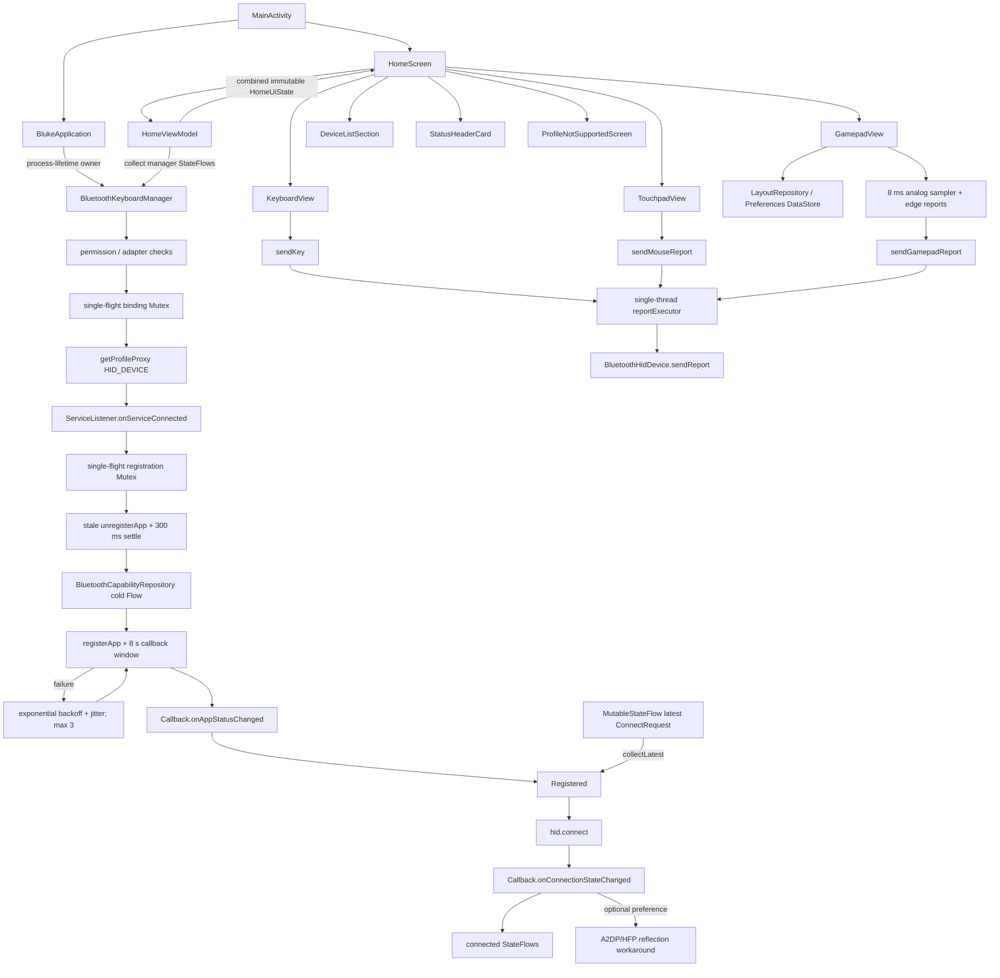

# Bluke Android platform audit

Audit date: 2026-09-15/16 (Asia/Calcutta)  
Audited revision: `ec01041` (`main`)  
Working branch: `refactor`

## 1. Executive summary

- **P0 fixed, device validation required — HID coordination:** explicit lifecycle states, single-flight binding/registration mutexes, callback-gated registration, bounded exponential backoff with jitter, and latest-request-wins connection collection are implemented.
- **P0 fixed — timeout safety:** `hid.connect()` is no longer called after a failed registration wait; an 8-second missing callback is `Inconclusive`, not `ProfileNotSupported`. After the three-attempt ceiling, the retained latest request now waits for a late callback without issuing an unbounded fourth registration command.
- **P1 fixed — process ownership:** `BlukeApplication` owns the manager for the application lifetime; teardown now closes the HID proxy/receivers and cancels executors/coroutines.
- **P1 mitigated — hidden APIs:** the invalid `setBluetoothClass(Int)` reflection was removed. A2DP/HFP reflection remains only behind an opt-in Linux workaround that defaults off.
- **P1 fixed — gamepad transport:** analog state is sampled by an 8 ms (125 Hz) ticker; button, D-pad, and final neutral/release edges bypass the sampler. The D-pad is now a HID Hat Switch instead of colliding button bits (Bluke issue #16).
- **P1 fixed, application retest required — gamepad compatibility:** the supplied Bluetooth capture proves the Hat descriptor reached the host and `evtest` proves all D-pad directions arrive. Guide/Share were moved out of canonical Web positions 12–15. Native Hat remains the default; an optional Web Compatibility encoder instead emits D-pad buttons 12–15 while holding the Hat neutral. The descriptor is identical in both modes.
- **P1 fixed — misleading restart action:** normal startup, registration, pairing, and pairing refusal no longer expose `Restart HID Service`; the action is restricted to exhausted proxy-binding or app-registration failures.
- **P1 mitigated — cached gamepad descriptor:** existing installations now receive a descriptor-revision prompt explaining the one-time requirement to forget and re-pair on both sides; fresh installs record the current revision during onboarding. Once refreshed, switching between Native Hat and Web Compatibility never changes SDP and does not require another pairing.
- **P1 fixed — layout persistence:** gesture changes are staged in memory and committed at gesture end through a single Preferences DataStore repository with one-time migration.
- **P1 partially fixed — UI state/performance:** Bluetooth, discovery, connection, lifecycle, and lock state are hoisted into immutable `HomeUiState`; rapidly changing gamepad button reads are isolated to child restart scopes and long-lived pointer handlers observe current callbacks. Editor/transient presentation state remains local.
- **P2 open — Compose alignment:** Material3 `1.4.0-alpha04` still lifts runtime to `1.8.0-alpha06`; removing the override fails compilation because `ThemeConfig.kt` uses Expressive-only APIs. A BOM/toolchain upgrade was prohibited in this pass.
- **P2 fixed — resources:** unused resources and three malformed high-density WebPs were removed; adaptive icon background is explicitly `nodpi`.
- Baseline: `assembleDebug` passed; lint reported 2 errors and 42 warnings; 3 tests passed and zero exercised Bluetooth/HID.
- Final: `assembleDebug`, 42 unit tests, and full `lintDebug` pass after the Web-profile follow-up. The suite includes 18 facade/OEM-behavior contract runs across simulated API 28/31/36 plus cardinal, diagonal, neutral-Hat, and default-policy coverage for both D-pad encoders. Debug lint reports 0 errors/21 warnings. The physical Android/OEM matrix remains open because ADB found no attached target.
- No SDK, AGP, Kotlin, Compose BOM, signing, Fastlane, or F-Droid version/config changes were made. DataStore `1.2.1` is the only new dependency.

## 2. Repository reconnaissance

### 2.1 File tree (`app/src/main` plus Gradle files)

The full `tree /F app\src\main` command was executed. Audio asset filenames are repetitive, so this checked-in report collapses only those directories; no source/resource entries are omitted.

```text
app/src/main/
├── AndroidManifest.xml
├── assets/audio/
│   ├── alpaca/{press,release}/*.mp3
│   ├── blackink/{press,release}/*.mp3
│   ├── bluealps/{press,release}/*.mp3
│   ├── boxnavy/{press,release}/*.mp3
│   ├── buckling/{press,release}/*.mp3
│   ├── cream/{press,release}/*.mp3
│   ├── holypanda/{press,release}/*.mp3
│   ├── mxblack/{press,release}/*.mp3
│   ├── mxblue/{press,release}/*.mp3
│   ├── mxbrown/{press,release}/*.mp3
│   ├── redink/{press,release}/*.mp3
│   ├── topre/{press,release}/*.mp3
│   └── turquoise/{press,release}/*.mp3
├── java/dev/arnv/bluke/
│   ├── AboutActivity.kt
│   ├── BlukeApplication.kt
│   ├── BehaviorActivity.kt
│   ├── DarkThemeActivity.kt
│   ├── DeveloperLogsActivity.kt
│   ├── DeveloperOptionsActivity.kt
│   ├── HelpActivity.kt
│   ├── LicensesActivity.kt
│   ├── LookAndFeelActivity.kt
│   ├── MainActivity.kt
│   ├── OnboardingActivity.kt
│   ├── SettingsActivity.kt
│   ├── bluetooth/BluetoothKeyboardManager.kt
│   ├── bluetooth/GamepadReport.kt
│   ├── bluetooth/HidLifecycle.kt
│   ├── bluetooth/HidRegistrationCoordinator.kt
│   ├── bluetooth/LatestRequestProcessor.kt
│   ├── data/LayoutRepository.kt
│   ├── sound/KeyboardSoundSynthesizer.kt
│   ├── utils/DeveloperLogManager.kt
│   └── ui/
│       ├── DeviceRow.kt
│       ├── GamepadInput.kt
│       ├── GamepadView.kt
│       ├── HomeScreen.kt
│       ├── HomeViewModel.kt
│       ├── KeyboardLayouts.kt
│       ├── KeyboardView.kt
│       ├── KeyCap.kt
│       ├── SettingsComponents.kt
│       ├── TouchpadView.kt
│       └── theme/{Color,Theme,ThemeConfig,Type}.kt
└── res/
    ├── drawable/{ic_dialpad_off,ic_dpad,ic_github,ic_launcher_foreground,ic_launcher_monochrome,ic_vibration_off,ic_wordmark}.xml
    ├── drawable/{ic_launcher_background,skin_0}.png
    ├── mipmap-anydpi-v26/{ic_launcher,ic_launcher_round}.xml
    ├── mipmap-{mdpi,hdpi,xhdpi,xxhdpi,xxxhdpi}/{ic_launcher,ic_launcher_round}.webp
    ├── values/{colors,strings,themes}.xml
    ├── values-night/themes.xml
    └── xml/{backup_rules,data_extraction_rules}.xml

build.gradle.kts
settings.gradle.kts
gradle.properties
gradle/libs.versions.toml
app/build.gradle.kts
```

The refactor adds `BlukeApplication.kt`, `HidLifecycle.kt`, `HidRegistrationCoordinator.kt`, `LatestRequestProcessor.kt`, `GamepadReport.kt`, `GamepadInput.kt`, `LayoutRepository.kt`, `HomeViewModel.kt`, `DeviceListSection.kt`, `StatusHeaderCard.kt`, `ProfileNotSupportedScreen.kt`, `values-v31/themes.xml`, and `values-night-v31/themes.xml`.

### 2.2 Kotlin inventory at `main` HEAD

| Lines | Path | Responsibility | Size flag |
|---:|---|---|---|
| 362 | `AboutActivity.kt` | About page, version/social actions, developer-mode unlock. | — |
| 1,022 | `BehaviorActivity.kt` | Behavior preferences for layouts, sounds, modes, and colors. | **CRITICAL** |
| 141 | `DarkThemeActivity.kt` | Dark-theme preference UI. | — |
| 179 | `DeveloperLogsActivity.kt` | Developer log viewer, filtering, and auto-save toggle. | — |
| 241 | `DeveloperOptionsActivity.kt` | Developer flags and mock-state controls. | — |
| 216 | `HelpActivity.kt` | Usage instructions and help sections. | — |
| 354 | `LicensesActivity.kt` | Third-party license data and searchable license UI. | — |
| 306 | `LookAndFeelActivity.kt` | Appearance and visual preference UI. | — |
| 103 | `MainActivity.kt` | App entry point, permissions, manager ownership, Compose root. | — |
| 450 | `OnboardingActivity.kt` | Paged onboarding, permissions, and connection guide. | Refactor candidate |
| 121 | `SettingsActivity.kt` | Settings navigation and lifecycle refresh. | — |
| 1,207 | `bluetooth/BluetoothKeyboardManager.kt` | Bluetooth HID capability, registration, connection, reports, receivers. | **CRITICAL** |
| 502 | `sound/KeyboardSoundSynthesizer.kt` | Low-latency keyboard switch audio loading and playback. | Refactor candidate |
| 100 | `utils/DeveloperLogManager.kt` | In-memory developer log state and optional file persistence. | — |
| 333 | `ui/DeviceRow.kt` | Device classification and Bluetooth-device row UI. | — |
| 2,710 | `ui/GamepadView.kt` | Gamepad UI, touch handling, editor, and report scheduling. | **CRITICAL** |
| 1,393 | `ui/HomeScreen.kt` | Home/config screen, mode navigation, settings/state, device lists. | **CRITICAL** |
| 650 | `ui/KeyboardLayouts.kt` | Keyboard/case models, palettes, and layout definitions. | Refactor candidate |
| 185 | `ui/KeyboardView.kt` | Keyboard surface and key layout rendering. | — |
| 153 | `ui/KeyCap.kt` | Individual key rendering and press behavior. | — |
| 157 | `ui/SettingsComponents.kt` | Shared settings cards, groups, and rows. | — |
| 1,072 | `ui/TouchpadView.kt` | Touchpad gestures, mouse reporting, buttons, and numpad overlay. | **CRITICAL** |
| 11 | `ui/theme/Color.kt` | Base theme colors. | — |
| 144 | `ui/theme/Theme.kt` | Material theme selection and system-bar styling. | — |
| 37 | `ui/theme/ThemeConfig.kt` | Theme shape helpers. | — |
| 36 | `ui/theme/Type.kt` | Typography definition. | — |

After extraction, `HomeScreen.kt` is 1,026 lines; the new files are `DeviceListSection.kt` (204), `StatusHeaderCard.kt` (144), and `ProfileNotSupportedScreen.kt` (99). `HomeScreen.kt` remains critical and needs state-hoisting work.

Post-refactor inventory additions/changed counts: `BlukeApplication.kt` 24 (process owner), `bluetooth/HidLifecycle.kt` 87 (state/retry/capability models), `bluetooth/HidRegistrationCoordinator.kt` 74 (facade-backed registration policy), `bluetooth/LatestRequestProcessor.kt` 26 (conflated cancellation policy), `bluetooth/GamepadReport.kt` 71 (pure HID gamepad packing and D-pad output policy), `ui/GamepadInput.kt` 39 (pure D-pad geometry), `data/LayoutRepository.kt` 65 (DataStore persistence/migration), `ui/HomeViewModel.kt` 102 (immutable Bluetooth UI state), `MainActivity.kt` 80, `BehaviorActivity.kt` 1,087, `BluetoothKeyboardManager.kt` 1,250, `GamepadView.kt` 2,802, and `HomeScreen.kt` 1,033. The original `main` inventory above remains the audit baseline.

### 2.3 Build configuration

| Setting | Observed value |
|---|---|
| min / target / compile SDK | 28 / 36 / `release(36) { minorApiLevel = 1 }` |
| AGP | 9.2.1 |
| Kotlin + Compose compiler plugin | 2.2.10 (`org.jetbrains.kotlin.plugin.compose`; compiler version follows Kotlin plugin) |
| Java / Kotlin JVM target | 17 / JVM 17 |
| Compose BOM | 2025.02.00 |
| Material3 override | 1.4.0-alpha04 |
| Version catalog | Yes: `gradle/libs.versions.toml`; coordinates are catalogued except plugin-management/toolchain literals. |
| Flavors | None |
| Debug build type | Defaults; no minification/resource shrinking configuration. |
| Release build type | `isMinifyEnabled=true`, `isShrinkResources=true`, PNG crunching, release signing config. |
| R8/ProGuard | `proguard-android-optimize.txt` + `app/proguard-rules.pro`; custom rules strip `Log.v`/`Log.d`. |
| Build cache | `org.gradle.caching=true`; dependency/test output showed `FROM-CACHE`. |
| Configuration cache | `org.gradle.configuration-cache=true`; dry-run succeeded and later builds reused the cache. |

No existing toolchain/library version was changed during this audit; stable DataStore `1.2.1` was added for layout persistence.

### 2.4 Manifest audit

| Permission | Exercised? | Evidence/assessment |
|---|---|---|
| `BLUETOOTH` | Yes on API 28–30 | Legacy permission for adapter/profile/device operations. |
| `BLUETOOTH_ADMIN` | Yes on API 28–30 | Discovery control and bonding paths use privileged legacy Bluetooth operations. |
| `BLUETOOTH_CONNECT` | Yes | Adapter name/state, bonded devices, device fields/bonding, profile binding, HID registration/connect/disconnect/report calls. Requested at runtime on API 31+. |
| `BLUETOOTH_SCAN` | Yes | `startDiscovery`, `cancelDiscovery`, discovery broadcasts. Requested at runtime; manifest uses `neverForLocation`. |
| `BLUETOOTH_ADVERTISE` | **No distinct call site found** | It is checked/requested, but `BluetoothHidDevice.registerApp` is documented as requiring `BLUETOOTH_CONNECT`, not `BLUETOOTH_ADVERTISE`. Candidate for device-tested removal, not changed here. |
| `ACCESS_FINE_LOCATION` | Yes on API 28–30 | Runtime gate for classic discovery. The code accepts fine **or coarse**; on Android 10/11, accepting coarse alone may be insufficient. |
| `ACCESS_COARSE_LOCATION` | Partially/legacy | Requested and accepted as an alternative to fine. Review per API 28–30 behavior before removal. |
| `VIBRATE` | Yes | Gamepad haptics use `Vibrator`/`VibrationEffect`. |

There are no `<uses-feature>` declarations. There are no services, foreground-service types, providers, or receivers in the manifest. `MainActivity` is the only exported component and is exported for its launcher intent filter; the other nine activities have no filters and default to unexported. Dynamic Bluetooth receivers are discussed below.

## 3. Architecture map



Compose/state graph:

```text
MainActivity
└── HomeScreen
    ├── HomeViewModel -> HomeUiState (lifecycle-aware collection)
    ├── remember/rememberSaveable UI and preference mirrors
    ├── lifecycle observer reloads SharedPreferences
    ├── config mode
    │   ├── StatusHeaderCard
    │   ├── DeviceListSection -> DeviceRow
    │   └── ProfileNotSupportedScreen
    └── active mode
        ├── KeyboardView -> KeyCap
        ├── TouchpadView
        └── GamepadView
            ├── 8 ms latest analog state sampler
            └── LayoutRepository -> Preferences DataStore

SettingsActivity -> separate Activity screens (Behavior, LookAndFeel, DarkTheme,
About, Help, Licenses, DeveloperOptions, DeveloperLogs); persistence is SharedPreferences.
```

Bluetooth/presentation state now crosses one `HomeViewModel` boundary. Transient mode/editor state still lives in composable `remember`/`rememberSaveable`; general settings remain in SharedPreferences, while gamepad geometry is migrated to DataStore.

### Threading inventory

- Compose event handlers, `LaunchedEffect`, and `DisposableEffect` run on the main dispatcher unless their context is changed; no explicit `Dispatchers.Main` call exists.
- `BluetoothKeyboardManager.managerScope = CoroutineScope(SupervisorJob() + Dispatchers.IO)` runs capability binding, registration, connect/disconnect waits, retries, and opt-in audio-profile sweeps. `BlukeApplication` owns it for the process lifetime; `close()` cancels the job and both executors.
- `HomeViewModel.viewModelScope` collects/composes manager flows; `collectAsStateWithLifecycle` presents `HomeUiState` only while the screen lifecycle is active.
- `DeveloperLogManager.scope = CoroutineScope(Dispatchers.IO)` is unscoped, has no retained `Job`, and is never cancelled.
- `reportExecutor` is a single foreground-priority thread. Every `sendReport()` call is submitted to it; no HID report is sent directly on the main thread.
- `executor` is a single background-priority scheduled executor used for HID callbacks and connection timeout tasks.
- No explicit `Dispatchers.Default`, `GlobalScope`, or `runBlocking` usage exists.

## 4. Executed tooling and build health

All commands were run against this checkout. On Windows, `gradlew.bat` is the wrapper equivalent of the requested `./gradlew` commands.

The host initially set Gradle's cache to an unwritable root directory:

```text
> .\gradlew.bat --version
Exception in thread "main" java.lang.RuntimeException: Could not create parent directory for lock file C:\.gradle\wrapper\dists\gradle-9.5.1-bin\...\gradle-9.5.1-bin.zip.lck
exit_code=1
```

Using a repository-local `GRADLE_USER_HOME` made Gradle runnable:

```text
Gradle 9.5.1
Kotlin:        2.3.20
Launcher JVM:  21.0.7 (Oracle Corporation 21.0.7+8-LTS-245)
OS:            Windows 11 10.0 amd64
exit_code=0
```

The sandbox then denied Java zip-filesystem access to Gradle's own JAR. Re-running the Gradle wrapper with the approved Gradle-only sandbox exception succeeded:

```text
> .\gradlew.bat clean --stacktrace
Caused by: java.nio.file.AccessDeniedException: ...\gradle-base-services-9.5.1.jar
BUILD FAILED

> .\gradlew.bat clean --stacktrace   # approved Gradle-only exception
> Task :app:clean UP-TO-DATE
BUILD SUCCESSFUL in 2m 22s
1 actionable task: 1 up-to-date
Configuration cache entry stored.
```

Baseline build:

```text
> .\gradlew.bat assembleDebug --warning-mode all --stacktrace
> Task :app:stripDebugDebugSymbols
Unable to strip the following libraries, packaging them as they are: libandroidx.graphics.path.so.
> Task :app:assembleDebug
BUILD SUCCESSFUL in 8m 44s
38 actionable tasks: 38 executed
Configuration cache entry stored.
```

No Kotlin compiler warnings, Gradle deprecation warnings, or `Deprecated Gradle features were used` notice appeared. The native strip warning above was the only baseline build warning.

Configuration-cache dry run:

```text
> .\gradlew.bat assembleDebug --configuration-cache --dry-run
Calculating task graph as configuration cache cannot be reused because ...android-36.1\package.xml has been created.
:app:assembleDebug SKIPPED
BUILD SUCCESSFUL in 5s
Configuration cache entry stored.
```

The one-time cache miss was caused by installation of Android SDK Platform 36.1 during the preceding build. Subsequent builds printed `Reusing configuration cache.` Build-cache compatibility is supported by observed `FROM-CACHE` tasks and `org.gradle.caching=true`.

Baseline lint commands:

```text
> .\gradlew.bat lint
Wrote HTML report to .../app/build/reports/lint-results-debug.html
Lint found 2 errors and 42 warnings. First failure:
...\values-night\themes.xml:4: Error: android:windowSplashScreenBackground requires API level 31 (current min is 28) [NewApi]
BUILD FAILED in 5m 15s

> .\gradlew.bat lintDebug
Lint found 2 errors, 42 warnings. First failure: [NewApi]
BUILD FAILED in 14s

> .\gradlew.bat lintRelease
Wrote HTML report to .../app/build/reports/lint-results-release.html
Lint found 2 errors and 42 warnings. First failure: [NewApi]
BUILD FAILED in 4m 24s
```

Lint was not muted and already emitted text, XML, and HTML, so no temporary lint configuration commit was needed. Reports are present at `app/build/reports/lint-results-{debug,release}.{txt,xml,html}`. SARIF is not generated by the project's default lint configuration.

After the mechanical fixes:

```text
> .\gradlew.bat assembleDebug
BUILD SUCCESSFUL in 4s
38 actionable tasks: 38 up-to-date
Configuration cache entry reused.

> .\gradlew.bat lintDebug
Wrote HTML report to .../app/build/reports/lint-results-debug.html
BUILD SUCCESSFUL in 2m 26s
29 actionable tasks: 9 executed, 20 up-to-date
Configuration cache entry reused.

# lint-results-debug.txt
0 errors, 40 warnings
```

### 4.1 Full baseline lint table

Each row below is one `<issue>` from the executed baseline `lint-results-debug.xml`. Debug and release contained the same 44 findings.

| Issue ID | Severity | File:line | Category | Explanation | Proposed fix | Fix risk |
|---|---|---|---|---|---|---|
| NewApi | Error | `values-night/themes.xml:4` | Correctness | API-31 splash attribute in API-28 resource. | Move to `values-night-v31` (done). | Low |
| NewApi | Error | `values/themes.xml:5` | Correctness | API-31 splash attribute in API-28 resource. | Move to `values-v31` (done). | Low |
| OldTargetApi | Warning | `app/build.gradle.kts:18` | Correctness | Lint sees API 37 while target is 36. | Upgrade only in a separately tested platform pass. | High |
| RedundantLabel | Warning | `AndroidManifest.xml:26` | Correctness | Main activity repeats application label. | Remove label (done). | Low |
| AndroidGradlePluginVersion | Warning | `libs.versions.toml:2` | Correctness | AGP 9.4.0 reported available. | Deferred by scope constraint. | High |
| GradleDependency | Warning | `app/build.gradle.kts:13` | Correctness | compileSdk 37 reported available. | Deferred by scope constraint. | High |
| GradleDependency | Warning | `libs.versions.toml:3` | Correctness | core-ktx 1.19.0 reported available. | Batch dependency update with regression tests. | Medium |
| GradleDependency | Warning | `libs.versions.toml:7` | Correctness | lifecycle-runtime-ktx 2.11.0 available. | Align lifecycle family together. | Medium |
| GradleDependency | Warning | `libs.versions.toml:8` | Correctness | lifecycle-viewmodel-compose 2.11.0 available. | Remove if unused; otherwise align. | Low/medium |
| GradleDependency | Warning | `libs.versions.toml:9` | Correctness | lifecycle-runtime-compose 2.11.0 available. | Align lifecycle family together. | Medium |
| GradleDependency | Warning | `libs.versions.toml:10` | Correctness | activity-compose 1.13.0 available. | Upgrade in dependency pass. | Medium |
| GradleDependency | Warning | `libs.versions.toml:12` | Correctness | Compose BOM 2026.09.00 available. | Deferred by scope constraint. | High |
| GradleDependency | Warning | `libs.versions.toml:17` | Correctness | androidx.test core 1.7.0 available. | Upgrade test stack together. | Low |
| GradleDependency | Warning | `libs.versions.toml:18` | Correctness | test runner 1.7.0 available. | Upgrade test stack together. | Low |
| GradleDependency | Warning | `libs.versions.toml:39` | Correctness | Material3 stable 1.4.0 available. | Remove alpha override / realign BOM. | Medium |
| NewerVersionAvailable | Warning | `libs.versions.toml:11` | Correctness | Kotlin Compose plugin 2.4.20 available. | Deferred by scope constraint. | High |
| NewerVersionAvailable | Warning | `libs.versions.toml:14` | Correctness | coroutines-android 1.11.0 available. | Align coroutine family. | Medium |
| NewerVersionAvailable | Warning | `libs.versions.toml:15` | Correctness | coroutines-core 1.11.0 available. | Remove redundant direct core or align. | Low/medium |
| NewerVersionAvailable | Warning | `libs.versions.toml:16` | Correctness | coroutines-test 1.11.0 available. | Align coroutine family. | Low |
| NewerVersionAvailable | Warning | `libs.versions.toml:19` | Correctness | Robolectric 4.17 available. | Upgrade test stack separately. | Low/medium |
| NewerVersionAvailable | Warning | `libs.versions.toml:20` | Correctness | Roborazzi plugin/catalog version 1.74.0 available. | Upgrade test tooling separately. | Medium |
| NewerVersionAvailable | Warning | `libs.versions.toml:20` | Correctness | Roborazzi core 1.74.0 available. | Same aligned upgrade. | Medium |
| NewerVersionAvailable | Warning | `libs.versions.toml:20` | Correctness | Roborazzi Compose 1.74.0 available. | Same aligned upgrade. | Medium |
| NewerVersionAvailable | Warning | `libs.versions.toml:20` | Correctness | Roborazzi JUnit rule 1.74.0 available. | Same aligned upgrade. | Medium |
| ObsoleteSdkInt | Warning | `BluetoothKeyboardManager.kt:655` | Performance | API `< 28` guard is unreachable at minSdk 28. | Remove guard (done). | Low |
| ObsoleteSdkInt | Warning | `res/mipmap-anydpi-v26` | Performance | v26 qualifier is below minSdk. | Move adaptive XML to `mipmap-anydpi` after launcher validation. | Low/medium |
| UnusedResources | Warning | `colors.xml:3` | Performance | `purple_200` unused. | Remove after dynamic-reference check. | Low |
| UnusedResources | Warning | `colors.xml:4` | Performance | `purple_500` unused. | Remove after dynamic-reference check. | Low |
| UnusedResources | Warning | `colors.xml:5` | Performance | `purple_700` unused. | Remove after dynamic-reference check. | Low |
| UnusedResources | Warning | `colors.xml:6` | Performance | `teal_200` unused. | Remove after dynamic-reference check. | Low |
| UnusedResources | Warning | `colors.xml:7` | Performance | `teal_700` unused. | Remove after dynamic-reference check. | Low |
| UnusedResources | Warning | `colors.xml:8` | Performance | `black` unused. | Remove after dynamic-reference check. | Low |
| UnusedResources | Warning | `colors.xml:9` | Performance | `white` unused. | Remove after dynamic-reference check. | Low |
| UnusedResources | Warning | `drawable/ic_dpad.xml:1` | Performance | D-pad drawable unused. | Remove after UI/device screenshot review. | Low |
| UnusedResources | Warning | `drawable/skin_0.png` | Performance | Skin bitmap unused. | Remove after dynamic-reference check. | Low |
| IconDipSize | Warning | `mipmap-xhdpi/ic_launcher.webp` | Usability:Icons | Lint reports wildly inconsistent xxhdpi decoded dimensions. | Re-export/validate all launcher WebPs. | Medium |
| IconDipSize | Warning | `mipmap-xhdpi/ic_launcher_round.webp` | Usability:Icons | Lint reports wildly inconsistent xx/xxxhdpi decoded dimensions. | Re-export/validate all round icons. | Medium |
| IconLocation | Warning | `drawable/ic_launcher_background.png` | Usability:Icons | Bitmap is in densityless `drawable`. | Move to appropriate density or `drawable-nodpi`. | Medium |
| IconLocation | Warning | `drawable/skin_0.png` | Usability:Icons | Bitmap is in densityless `drawable`. | Remove if unused or move to `drawable-nodpi`. | Low |
| UseKtx | Warning | `AboutActivity.kt:111` | Productivity | Manual SharedPreferences editor chain. | Use `edit {}` extension. | Low |
| UseKtx | Warning | `DeveloperLogsActivity.kt:132` | Productivity | Manual SharedPreferences editor chain. | Use `edit {}` extension. | Low |
| UseKtx | Warning | `DeveloperOptionsActivity.kt:119` | Productivity | Manual SharedPreferences editor chain. | Use `edit {}` extension. | Low |
| UseKtx | Warning | `DeveloperOptionsActivity.kt:152` | Productivity | Manual SharedPreferences editor chain. | Use `edit {}` extension. | Low |
| UseKtx | Warning | `DeveloperOptionsActivity.kt:201` | Productivity | Manual SharedPreferences editor chain. | Use `edit {}` extension. | Low |

Special-category result: lint emitted no `InlinedApi`, `MissingPermission`, `PrivateApi`, `DiscouragedPrivateApi`, `BlockedPrivateApi`, `SoonBlockedPrivateApi`, `IconDensities`, `Overdraw`, `VectorPath`, Compose correctness/performance IDs, foreground-service/exported-receiver IDs, `StringFormatInvalid`, `MissingTranslation`, or `HardcodedText`. This is **not** proof of safety: `@SuppressLint("MissingPermission")` is broad throughout Bluetooth/UI code, and reflection hides private-API targets from static lint.

### 4.2 Additional analysis

Neither detekt nor ktlint is configured; per scope, neither was added. Proposed configuration (version availability should be rechecked when adopted):

```kotlin
// root build.gradle.kts
plugins {
    id("io.gitlab.arturbosch.detekt") version "1.23.8" apply false
}

// app/build.gradle.kts
plugins { id("io.gitlab.arturbosch.detekt") }
detekt {
    buildUponDefaultConfig = true
    allRules = false
    config.setFrom(rootProject.files("config/detekt/detekt.yml"))
    baseline = file("config/detekt/baseline.xml")
}
tasks.withType<io.gitlab.arturbosch.detekt.Detekt>().configureEach {
    jvmTarget = "17"
    reports { html.required.set(true); sarif.required.set(true) }
}
```

ASSUMPTION: Detekt `1.23.8` is used as a conservative proposed pin; verify current plugin compatibility with Kotlin 2.2/Gradle 9 before landing it.

Dependency command:

```text
> .\gradlew.bat :app:dependencies --configuration releaseRuntimeClasspath
releaseRuntimeClasspath - Runtime classpath of '/release'.
+--- androidx.compose:compose-bom:2025.02.00
|    +--- androidx.compose.material3:material3:1.3.1 -> 1.4.0-alpha04 (c)
|    +--- androidx.compose.runtime:runtime:1.7.8 -> 1.8.0-alpha06 (c)
...
+--- androidx.compose.material3:material3:1.4.0-alpha04
...
BUILD SUCCESSFUL in 6s
1 actionable task: 1 executed
```

Gradle resolves duplicate/version requests to single selected modules, so no duplicate class conflict was reported. The meaningful conflicts are the Material3-driven runtime alpha override, collection `1.5.0-alpha06`, and normal convergence of older transitive Kotlin/coroutines/lifecycle versions to direct pins. `kotlinx-coroutines-core` is redundant because `kotlinx-coroutines-android` already brings core. `lifecycle-viewmodel-compose` has no `viewModel()` use. KSP is applied with no processors (`kspDebugKotlin SKIPPED`). Material Icons Extended is large and should be audited because it is used only as an icon source, but replacing it would be feature/UI work.

Unit-test command:

```text
> .\gradlew.bat testDebugUnitTest
> Task :app:testDebugUnitTest
> Task :app:finalizeTestRoborazziDebug SKIPPED
BUILD SUCCESSFUL in 2m 4s
30 actionable tasks: 7 executed, 1 from cache, 22 up-to-date
```

JUnit XML records 3 tests, 0 failures, 0 errors, 0 skipped. No coverage plugin/report is configured. There are zero Bluetooth/HID test classes or test references, so effective Bluetooth/HID behavioral coverage is **0%** even though a numeric instruction-coverage percentage was not generated.

## 5. Targeted issue audit

The “Current implementation” and “Concrete defect” columns below describe the audited `main` revision `ec01041`; they preserve the evidence that motivated the work. The final implementation/status is recorded in Sections 1, 6, and 7.1.

### 5.1 Bluetooth lifecycle and state

| Area | Current implementation | Concrete defect | Proposed design | Files touched | Risk |
|---|---|---|---|---|---|
| Dead-process SDP registration | `registerApp()` calls `unregisterApp()`, delays 300 ms, then makes 3 `registerApp()` calls with fixed 400 ms waits. | Return `true` means the command was sent, not that callback registration completed. Fixed retry timing can overlap native cleanup and lacks jitter. Prompt said 250 ms; audited code is 300 ms. | Callback-driven `Idle → BindingProxy → Registering → Registered → Connecting → Connected → Error`; exponential backoff with jitter (for example 300/600/1200 ms ±20%), named max attempts, and callback/timeout generation IDs to ignore stale callbacks. | Proposed: Bluetooth manager split plus new capability/repository classes. No behavior change landed. | High; OEM Bluetooth stacks vary. |
| Async proxy binding | `getProfileProxy()` is retried; a nullable single `pendingConnectAfterRestart` stores one request. | No mutex/single flight; repeated capability checks can bind concurrently. A second request overwrites the first. A coroutine captures a stale `hid` proxy. | `Mutex` around bind/register; `Channel<ConnectRequest>(capacity = Channel.UNLIMITED)` or explicitly conflated `SharedFlow` if latest-wins is desired. Drain only in Registered state. | Proposed Bluetooth repository/coordinator. | Medium/high. |
| Registration timeout / OEM missing callback | There is no 8-second registration watchdog in current HEAD. `connectDevice` waits up to 3 seconds for `appRegistrationState.first { it }`, ignores timeout result, then calls `connect`. | Missing callback leaves state ambiguous; connection proceeds unregistered. Capability and transient registration failure both become UI profile errors/status strings. | `BluetoothCapabilityRepository.capability(): Flow<Capability>`; named `APP_REGISTRATION_TIMEOUT_MS = 8_000L` (longer than observed 200–2,000 ms binding plus stack variance), cold flow per probe, and separate Unsupported / Timeout / Permission / StackError results. | Proposed new repository; no UI coupling. | Medium. |
| Audio interference | Three sweeps at 0.5/2.0/3.5 s acquire A2DP and Headset proxies, reflect `disconnect(BluetoothDevice)`, then close each callback proxy. | `disconnect` is hidden/system API; reflection can be blocked or require privileged permissions. Three repeated binds are expensive. | Keep public `getProfileProxy`/`closeProfileProxy`; do not promise disconnect from a third-party app. Prefer user-visible profile guidance or an explicit best-effort adapter isolated behind capability checks. | `BluetoothKeyboardManager.kt` proposed. | High; behavior and platform policy. |
| Proxy lifecycle | HID proxy is closed in `close()` only when `MainActivity.isFinishing`; A2DP/HFP callback proxies close in `finally`. | `cleanup()` does not unregister HID app/close proxy. `close()` does not cancel `managerScope` or shut down either executor. `onServiceDisconnected` says “Rebinding” but does not initiate a bind. | One idempotent `close()` that cancels scope, cancels timeout, unregisters app/receivers, closes all acquired proxies, and shuts down executors; lifecycle owner should be process/service scoped. | Proposed. Existing proxy closure was already present, so no duplicate fix landed. | Medium. |
| Receivers | Bond/state receiver registered at init; discovery receiver registered on first scan. Both are unregistered in `close()` and `cleanup()` under flags. API 33+ uses `RECEIVER_EXPORTED`. | Registration/unregistration is symmetric. `EXPORTED` expands exposure but can be necessary for highly privileged Bluetooth-system broadcasts; changing it blindly may break OEM delivery. | Keep explicit flags; validate `RECEIVER_NOT_EXPORTED` on target devices before tightening. Make close idempotent and central. | No change. | Medium. |

Hidden API targets:

- `proxy.javaClass.getMethod("disconnect", BluetoothDevice::class.java)` resolves to `BluetoothA2dp.disconnect(BluetoothDevice)` and `BluetoothHeadset.disconnect(BluetoothDevice)`. AOSP marks these `@hide`/`@SystemApi`; Headset also has system/telephony permission history. Android's non-SDK policy treats test APIs as blocked from Android 11 and allows OEMs to add restrictions. Static lint misses these because the owner class is dynamic.
- `BluetoothAdapter::class.java.getDeclaredMethod("setBluetoothClass", Int.TYPE)` targets a signature that does not exist in audited AOSP (`setBluetoothClass(BluetoothClass)` is the hidden signature and requires `BLUETOOTH_PRIVILEGED`). Therefore the current Int reflection should consistently throw `NoSuchMethodException`; even a corrected signature would not be available to a normal third-party app.
- Current policy/source references: [Android non-SDK restrictions](https://developer.android.com/guide/app-compatibility/restrictions-non-sdk-interfaces), [AOSP BluetoothA2dp](https://android.googlesource.com/platform/packages/modules/Bluetooth/+/57b823f4f7/framework/java/android/bluetooth/BluetoothA2dp.java), [AOSP BluetoothHeadset](https://android.googlesource.com/platform/packages/modules/Bluetooth/+/57b823f4f7/framework/java/android/bluetooth/BluetoothHeadset.java), and [AOSP BluetoothAdapter](https://android.googlesource.com/platform/packages/modules/Bluetooth/+/9025756b0e/framework/java/android/bluetooth/BluetoothAdapter.java).

ASSUMPTION: Exact hidden-API flags can differ on OEM Android 16 images; this audit verified AOSP policy/source, not runtime `hidden_api_policy` logcat on physical Motorola/Tecno/LG devices.

### 5.2 HID report pipeline

- One 183-byte composite descriptor is a property-level `byteArrayOf` literal in `BluetoothKeyboardManager.kt`; it is assembled at instance construction from byte literals (not loaded from resources or generated conditionally). It contains keyboard report ID 1, mouse report ID 2, and gamepad report ID 3. The mutable `ByteArray` reference is private and not modified after construction.
- SDP settings are: name `Bluke`, description `Wireless Controller Combo`, provider `Bluke`, subclass `BluetoothHidDevice.SUBCLASS1_COMBO` = `0xC0` / signed byte `-64`, descriptor above. All three QoS arguments are `null`.
- The only framework `sendReport()` call is `submitReport()` line 65 at baseline. `sendKey`, `sendMouseReport`, and `sendGamepadReport` construct 8-, 4-, and 11-byte payloads and enqueue them to one `reportExecutor`.
- The single-thread executor preserves enqueue order and does not intentionally drop reports. It is unbounded, so bursts can accumulate stale motion reports and increase latency. Exceptions drop only the failed report. Connection callback events use a separate `MutableSharedFlow` with `DROP_OLDEST`, but that is not the HID payload queue.
- No framework report is sent on the main thread. Payload construction and gamepad state mutation occur on the Compose/main thread, followed by executor submission.
- Gamepad immediate motion reports are gated by `>= 8L`, but dirty state is flushed every `10L.milliseconds`; forced press/release reports bypass the gate. A refactor should sample latest state on a strict 8 ms ticker, send transition edges without reordering, and make backpressure semantics explicit.
- At audited `main`, descriptor semantics had not been changed. The first authorized second pass corrected report ID 3 to 16 buttons + a four-bit Hat Switch + four bits padding + four 16-bit axes (11 bytes). Analysis of the supplied capture then exposed a separate raw-index collision. The final report ID 3 layout is 19 declared buttons + five button-padding bits + a four-bit Hat Switch + four Hat-padding bits + four 16-bit axes (12 bytes). Native mode emits indices 0–11 and 16–18 and uses the Hat; Web Compatibility reserves the same auxiliary positions, holds the Hat neutral, and maps Up/Down/Left/Right to buttons 12/13/14/15. The descriptor and report length never change between modes. The revision from released `main` still requires one pairing refresh because the report grew from 11 to 12 bytes.

### 5.3 Compose UI and performance

| Area | Current implementation | Defect | Proposed design | Files | Risk |
|---|---|---|---|---|---|
| Gamepad recomposition | Stick/D-pad/editor state is held near the `GamepadView` root. Stick visuals already use lambda `Modifier.offset {}` and `rememberUpdatedState` in key low-level components. | Root-owned state still invalidates broad portions of a 2,710-line tree. D-pad rotation reads composition state. | Split stable controller state; defer position reads to `offset {}`/`graphicsLayer`; use `rememberUpdatedState` for gesture callbacks; isolate each control. | `GamepadView.kt` | Medium. |
| Report cadence | 8 ms event gate + 10 ms dirty ticker. | Not pinned at 125 Hz and touch frequency still influences immediate sends. | One 8 ms ticker samples latest atomic/snapshot state; touch only mutates state; preserve edge reports deliberately. | `GamepadView.kt`, report scheduler tests | Medium/high. |
| Home screen | One composable held 1,393 lines and all state. This pass extracted three requested visual sections, leaving 1,026 lines. | No `HomeUiState`/ViewModel; duplicated Flow collection and preference mirroring; business/presentation coupling. | Introduce immutable `HomeUiState`, reducer/ViewModel, lifecycle-aware collection, then split active-mode host and launch controls. | `HomeScreen.kt` plus new state/ViewModel files | Medium. |
| Layout persistence | `saveLayoutPref` calls SharedPreferences `apply()` on every pan/zoom callback. | Excess editor allocation/disk scheduling and jank risk during gesture. | `LayoutRepository` backed by DataStore; in-memory edits during gesture, debounce/batch and commit on gesture end. | `GamepadView.kt`, new repository | Medium; migration needed. |

Effect/key audit:

| Location | Effect/key | Finding |
|---|---|---|
| `HelpActivity.kt:40` | `LaunchedEffect(timer)` | Scalar key is stable; effect intentionally restarts with timer changes. |
| `DeveloperOptionsActivity.kt:48` | `LaunchedEffect(catClicked)` | Stable scalar key. |
| `DeveloperLogsActivity.kt:62` | `LaunchedEffect(filteredLogs.size)` | Stable key, but same-size content replacement will not trigger scroll. |
| `OnboardingActivity.kt:138,148` | Two `LaunchedEffect(pagerState.currentPage)` | Stable key; duplicated effects should be combined to avoid ordering ambiguity. |
| `HomeScreen.kt` update check | `LaunchedEffect(sharedPrefs)` | One-shot per preferences instance; the captured dependency is now explicit. |
| `HomeScreen.kt:207` | connection/LED/mode tuple | Primitive/string keys are stable and complete for the body. |
| `HomeScreen.kt:218` | `LaunchedEffect(btState)` | Sealed state values are stable enough; connected data class changes on name. |
| `HomeScreen.kt:227` | `LaunchedEffect(btMessage)` | Stable string key; repeated identical errors do not toast again. |
| `HomeScreen.kt:240` | `LaunchedEffect(isKeyboardActive)` | Stable Boolean key; context/window is captured but not keyed. |
| `GamepadView.kt` report ticker | `LaunchedEffect(btManager)` | Manager is keyed and cadence is now 8 ms. Snapshot state is read only by the coroutine, not during root composition. |
| `SettingsActivity.kt:36` | `DisposableEffect(lifecycleOwner)` | Stable lifecycle key; unregisters observer symmetrically. |
| `HomeScreen.kt` lifecycle observer | `DisposableEffect(lifecycleOwner, sharedPrefs, soundSynth)` | All captured service-like dependencies are keyed; observer unregisters symmetrically. |
| `Theme.kt:89` | `DisposableEffect(context)` | Context is the correct key for registered/theme-side cleanup. |
| `GamepadView.kt` button/D-pad handlers | `pointerInput(Unit)` + `rememberUpdatedState` | Long-lived gesture coroutines retain stable state holders and invoke current callbacks; D-pad also filters its initiating pointer ID. |
| `HomeScreen.kt` preferences | `remember(context)` | Context dependency is explicit. |
| `GamepadView.kt` vibration preference | `remember(sharedPrefs)` | Preferences dependency is explicit for previews/tests. |

No `CoroutineCreationDuringComposition`, `ProduceStateDoesNotAssignValue`, `UnrememberedMutableState`, `FrequentlyChangedStateReadInComposition`, or `AutoboxingStateCreation` finding was emitted by executed lint.

## 6. Independently shippable refactor sequence

1. API-qualified splash resources/unreachable guard cleanup — complete.
2. Pure Home visual-section extraction — complete.
3. Process-scoped Bluetooth owner and complete teardown — complete.
4. Lifecycle/capability models, callback-gated retry policy, single-flight binding, and latest-wins connect collection — complete; physical OEM validation remains.
5. Invalid Class-of-Device reflection removal and opt-in audio workaround — complete; Linux validation remains.
6. Immutable Bluetooth `HomeUiState` plus lifecycle-aware `HomeViewModel` — complete; remaining presentation/editor state can be hoisted later.
7. 8 ms analog sampler with edge reports — complete; transport cadence needs hardware capture validation.
8. DataStore layout repository, one-time migration, and gesture-end transaction — complete.
9. Unused build declarations and resources — complete.
10. Late registration callback recovery — complete; retained latest request resumes on callback without another registration command.
11. D-pad Hat Switch, gesture pointer ownership, neutral teardown report, and pure packing/geometry tests — complete; physical host validation remains.
12. Narrow gamepad recomposition scopes and repair effect/callback keys — complete; production-source lint remains clean.
13. Compose BOM/Material3 alignment — intentionally unchanged at the maintainer's request.
14. Extract a framework-neutral Bluetooth registration facade and latest-request processor — complete; deterministic API 28/31/36 simulations pass. Physical OEM/radio validation remains required before release.
15. Reserve raw gamepad button indices 12–15 and move auxiliary buttons to 16–18 — complete from supplied capture evidence; retest in the originally failing application remains required.
16. Add a descriptor-stable Web Compatibility encoder for D-pad buttons 12–15 — complete with cardinal, diagonal, neutral-Hat, reserved-bit, and preference-default unit coverage; browser and native-device validation remains required.

## 7. Changes intentionally not made

- No keyboard or mouse descriptor semantic changes. The gamepad-only corrections were accepted because issue #16 and the supplied capture document host-visible defects. The final gamepad packet is 12 bytes. Native mode emits only the Hat; Web Compatibility emits only buttons 12–15. Neither mode duplicates a D-pad action into both representations.
- No public-API replacement exists for third-party A2DP/HFP disconnect. The surviving reflection is disabled by default and isolated behind the optional setting.
- No receiver flag change: `RECEIVER_EXPORTED` may be needed for Bluetooth broadcasts sent by a privileged system package.
- No wholesale `HomeScreen`/`GamepadView` rewrite: narrow, measurable restart-scope changes landed first; moving ~2,800 lines mechanically before device validation would make regressions harder to bisect.
- No AGP, Kotlin, Compose BOM, SDK, target, or signing change. The only added coordinate is stable `androidx.datastore:datastore-preferences:1.2.1`.
- No adaptive-icon qualifier suppression: moving `<adaptive-icon>` from `mipmap-anydpi-v26` made AAPT fail to resolve both manifest icons, so the one `ObsoleteSdkInt` warning is retained.
- No lint baseline or blanket suppression; lint reporting was already enabled sufficiently for HTML/XML/text.
- No changes under `fastlane/`, F-Droid metadata, signing config, or license terms.

### 7.1 Post-refactor tooling evidence (2026-09-16)

`./gradlew lintDebug testDebugUnitTest --warning-mode all --stacktrace`:

```text
> Task :app:testDebugUnitTest
> Task :app:lintReportDebug
Wrote HTML report to file:///C:/Users/DELL/Documents/Bluke/app/build/reports/lint-results-debug.html
> Task :app:lintDebug
BUILD SUCCESSFUL in 2m 20s
39 actionable tasks: 14 executed, 25 up-to-date
Configuration cache entry reused.
```

Test XML totals: 6 tests, 0 skipped, 0 failures, 0 errors. `HidLifecycleTest` adds three tests for exponential backoff, rejected registration, and treating an 8-second callback timeout as inconclusive. Bluetooth framework callback/transport coverage is still zero because it requires a facade or instrumented hardware tests.

`./gradlew lintRelease --warning-mode all --stacktrace`:

```text
> Task :app:lintReportRelease
Wrote HTML report to file:///C:/Users/DELL/Documents/Bluke/app/build/reports/lint-results-release.html
> Task :app:lintRelease
BUILD SUCCESSFUL in 3m 19s
16 actionable tasks: 5 executed, 11 up-to-date
Configuration cache entry reused.
```

Final XML issue counts:

| Variant | Errors | Warnings | Remaining IDs |
|---|---:|---:|---|
| debug | 0 | 21 | `GradleDependency` 10, `NewerVersionAvailable` 8, `AndroidGradlePluginVersion` 1, `OldTargetApi` 1, `ObsoleteSdkInt` 1 |
| release | 0 | 20 | version/SDK availability and adaptive-icon qualifier findings only |

Resource cleanup reduced debug lint from 39 to 26 warnings; KTX preference edits reduced it to 21. The failed adaptive-icon experiment produced this real AAPT output before being reverted:

```text
Execution failed for task ':app:processDebugResources'.
Android resource linking failed
AndroidManifest.xml: AAPT: error: resource mipmap/ic_launcher not found.
AndroidManifest.xml: AAPT: error: resource mipmap/ic_launcher_round not found.
BUILD FAILED in 1m 20s
```

The final release dependency graph succeeds and confirms DataStore `1.2.1`. It also confirms the unresolved Compose skew: Material3 `1.4.0-alpha04` overrides BOM `1.3.1` and selects runtime/runtime-saveable `1.8.0-alpha06` while most UI artifacts remain `1.7.8`. Removing the override was tested and failed on `ExperimentalMaterial3ExpressiveApi`, `MaterialShapes`, and `toShape` references in `ThemeConfig.kt`; it was restored instead of violating the version constraint.

Research used current official primary sources: [Android Compose BOM guidance](https://developer.android.com/develop/ui/compose/bom) (individual Compose versions should be omitted when using a BOM), [Compose phase guidance](https://developer.android.com/develop/ui/compose/performance/bestpractices) (lambda modifiers defer frequently changing reads), [DataStore guidance](https://developer.android.com/topic/libraries/architecture/datastore) (one instance per file, repository/data-layer ownership), [DataStore release notes](https://developer.android.com/jetpack/androidx/releases/datastore) (stable `1.2.1` on 2026-09-09), [`BluetoothHidDevice` callback documentation](https://developer.android.com/reference/android/bluetooth/BluetoothHidDevice.Callback), and Kotlin [`StateFlow`](https://kotlinlang.org/api/kotlinx.coroutines/kotlinx-coroutines-core/kotlinx.coroutines.flow/-state-flow/) / [`conflate`](https://kotlinlang.org/api/kotlinx.coroutines/kotlinx-coroutines-core/kotlinx.coroutines.flow/conflate.html) documentation.

### 7.2 Maintainer decisions and second-pass resolutions (2026-09-16)

| Decision/finding | Resolution | Benefits | Cost/risk |
|---|---|---|---|
| Latest connection selection wins. | The existing conflated `StateFlow` + `collectLatest` design remains. After the bounded three registration attempts time out, `connectWhenReady` suspends on `appRegistrationState.first { it }`; a later callback resumes that request, while a newer selection cancels it. | No unbounded `registerApp()` loop; late Motorola/Tecno/LG-style callbacks are useful; deterministic latest-wins cancellation. | A firmware that never calls back retains one suspended coroutine until a newer request, Bluetooth teardown, or process teardown cancels it. |
| The 8-second callback timeout is a weak field baseline. | It remains a named constant and produces `Inconclusive`, never “unsupported.” Three attempts remain the hard command ceiling. | Honest capability semantics and bounded active retries. | Worst-case UI wait before passive late-callback mode is approximately 24 seconds plus backoff/cleanup. |
| Audio prevention is optional. | Hidden A2DP/HFP `disconnect(BluetoothDevice)` reflection remains default-off. Public proxy acquisition/closure is retained. | Preserves the only available best-effort workaround for issue #7 without affecting default behavior. | Android exposes no public third-party disconnect call; OEM hidden-API policy may block it. It cannot be called “fixed” until tested on the affected Linux route. |
| Compose dependency set stays as-is. | No Compose BOM, Material3, Kotlin, AGP, SDK, or target change. | Avoids combining lifecycle/input fixes with an alpha/stable alignment migration. | Known Material3/runtime skew remains and should be handled separately only when the maintainer chooses. |
| Neutral/reset gamepad reports. | Buttons/D-pad already bypass sampling; disposal now sends an immediate all-released, centered-stick, neutral-hat report before the 8 ms ticker is cancelled. | Prevents stuck buttons/axes when switching modes or leaving the screen. | One extra 12-byte report on Gamepad disposal. |
| Bluke issue #16 and supplied host capture. | D-pad remains Generic Desktop Hat Switch usage `0x39`; the gesture tracks its initiating pointer; geometry uses an absolute arm-width threshold. The capture proved that reusing button indices 12–14 for guide/share/touchpad collides with the W3C standard positions 12–15 in position-based consumers, so those four indices are reserved and auxiliary buttons now use 16–18. | No dropped Right direction at HID/evdev; correct multi-touch ownership; Menu/Share can no longer masquerade as standard D-pad Up/Down. | Report ID 3 grows from 11 to 12 bytes and descriptor cache makes re-pairing mandatory. Linux exposes button usages above 16 as `BTN_TRIGGER_HAPPY*`, so application-level semantics still require cross-host validation. |

The gamepad decision is backed by the project's [issue #16](https://github.com/arnav-kr/Bluke/issues/16), the USB-IF [HID Usage Tables](https://www.usb.org/hid) (Hat Switch is Generic Desktop usage `0x39`), the [Linux gamepad specification](https://www.kernel.org/doc/html/latest/input/gamepad.html), Linux's current [`hid-input.c`](https://github.com/torvalds/linux/blob/master/drivers/hid/hid-input.c), and the W3C [Standard Gamepad layout](https://www.w3.org/TR/gamepad/#remapping). Compose changes follow the current Android guidance to defer state reads and use lambda modifiers; no new Compose dependency was introduced.

Second-pass verification:

```text
> .\gradlew.bat :app:testDebugUnitTest :app:assembleDebug --no-daemon --warning-mode all
> Task :app:assembleDebug
> Task :app:testDebugUnitTest
BUILD SUCCESSFUL in 2m 35s
47 actionable tasks: 11 executed, 36 up-to-date
Configuration cache entry reused.
```

JUnit XML totals at that checkpoint: **13 tests, 0 failures, 0 errors, 0 skipped**. `GamepadReportTest` verified all Hat Switch values, the neutral report, axis packing, and the then-current 11-byte packet. `GamepadInputTest` swept the visible cardinal arms, corners, center deadzone, non-square bounds, and reachable masks. Section 7.4 records the later capture-driven 12-byte layout and verification.

Production-source lint after the Compose pass:

```text
> .\gradlew.bat :app:lintDebug -x :app:lintAnalyzeDebugUnitTest --no-daemon --no-parallel
> Task :app:lintReportDebug
Wrote HTML report to file:///C:/Users/DELL/Documents/Bluke/app/build/reports/lint-results-debug.html
> Task :app:lintDebug
BUILD SUCCESSFUL in 38s
28 actionable tasks: 2 executed, 2 from cache, 24 up-to-date
```

The exclusion is not a source suppression. Two full reruns failed only because another Java process held AGP's generated unit-test lint cache JAR:

```text
Execution failed for task ':app:lintAnalyzeDebugUnitTest'.
java.nio.file.FileSystemException: ...RuntimeIssueRegistry-81d6cad1ff46c20f..jar:
The process cannot access the file because it is being used by another process
```

The production analyzer and report completed with the same 21 version/SDK warnings and no Gamepad/Home/Compose correctness issue. Unit tests and `assembleDebug` completed separately in 58 seconds. No source or dependency change was made to work around the environmental file lock.

### 7.3 API/OEM validation matrix

The production registration policy now depends on `BluetoothRegistrationFacade`, with framework calls adapted inside `BluetoothKeyboardManager`. `HidRegistrationCoordinator` owns cleanup, the hard attempt ceiling, callback timeout, retry backoff, and passive late-callback wait. `LatestRequestProcessor` is the production `StateFlow`/`collectLatest` path, not a test duplicate.

Robolectric ran the same facade contract on API 28, 31, and 36. Each API executed these six checks: correct SDK selection, first-attempt callback success, three rejected commands, three accepted commands with no callback, late callback resumption without a fourth command, and existing-registration/forced-reset behavior.

```text
> .\gradlew.bat :app:testDebugUnitTest --tests "dev.arnv.bluke.bluetooth.BluetoothRegistrationFacadeApi*" --no-daemon --no-parallel --stacktrace
BUILD SUCCESSFUL in 3m 5s
30 actionable tasks: 5 executed, 25 up-to-date

BluetoothRegistrationFacadeApi28Test: tests=6 failures=0 errors=0 skipped=0
BluetoothRegistrationFacadeApi31Test: tests=6 failures=0 errors=0 skipped=0
BluetoothRegistrationFacadeApi36Test: tests=6 failures=0 errors=0 skipped=0
```

The first combined run exposed a test-scheduler mistake in the new latest-request test; the real failure was:

```text
LatestRequestProcessorTest > newerRequestCancelsInFlightWorkAndCompletesLatest FAILED
java.lang.AssertionError: expected:<[first, latest]> but was:<[first]>
33 tests completed, 1 failed
BUILD FAILED in 2m 36s
```

The test used `advanceUntilIdle()`, which does not drain `backgroundScope` work as assumed. Replacing it with `runCurrent()` made the cancellation assertion deterministic. The corrected full gate is:

```text
> .\gradlew.bat :app:testDebugUnitTest :app:assembleDebug --no-daemon --no-parallel --warning-mode all
> Task :app:assembleDebug UP-TO-DATE
> Task :app:testDebugUnitTest
BUILD SUCCESSFUL in 51s
47 actionable tasks: 1 executed, 46 up-to-date

tests=33 failures=0 errors=0 skipped=0
```

An earlier full `lintDebug` retry failed before analysis completion on the previously documented external lock of AGP's generated `RuntimeIssueRegistry` cache JAR. Production-source lint excluding only that generated unit-test analyzer succeeded at that point:

```text
> .\gradlew.bat :app:lintDebug -x :app:lintAnalyzeDebugUnitTest --no-daemon --no-parallel --warning-mode all
> Task :app:lintReportDebug
> Task :app:lintDebug
BUILD SUCCESSFUL in 2m 19s
28 actionable tasks: 4 executed, 24 up-to-date
```

A later full retry, after the external lock was released, succeeded; the lock was environmental rather than a source failure.

#### Physical matrix status

No Android device or AVD was available locally. Real output was:

```text
List of devices attached
```

Therefore the audio-routing workaround, real SDP registration timing, and OEM behavior are **not locally verified**. The supplied Linux `pcapng`/`evtest` evidence now verifies the revision-2 HID descriptor and report path; Section 7.4 records that result. Use the debug APK from `app/build/outputs/apk/debug/app-debug.apk`, and remove the old pairing on both phone and host before every descriptor test.

| Target | Required checks | Evidence to capture |
|---|---|---|
| API 28 | Fresh pair, connect, keyboard/mouse/gamepad, mode exit while holding a control, reconnect after force-stop. | Bluke developer log + host input events. |
| API 31 | Deny/grant Nearby Devices, scan/connect, Bluetooth toggle, reconnect. | Permission UI result and callback timeline. |
| API 36 | Same matrix plus background/foreground and repeated process recreation. | Callback times from `registerApp()` through `onAppStatusChanged` and connection state. |
| Motorola/Tecno/LG | Repeat fresh pair, force-stop/relaunch, and Bluetooth toggle at least three times. LG V50 is specifically represented by issues #11 and #21. | Device model/build fingerprint, Android version, complete developer log; note any callback later than 8/16/24 seconds. |
| Linux host | With `Prevent Host Audio Routing` off, record whether PipeWire/WirePlumber routes phone audio to the PC. Repeat with it on across reconnect and Bluetooth toggle. | `wpctl status`/desktop route before and after, Android log lines for all A2DP/HFP sweeps. |
| Linux/Windows gamepad | Revision 2 passed the supplied Linux transport capture. Re-pair revision 3, then press every D-pad direction/diagonal and guide/share/touchpad; leave Gamepad while holding each class of control. | Linux `evtest` must retain `ABS_HAT0X/Y`; indices 12–15 must never emit; auxiliary inputs should follow them. Windows Game Controllers/SDL and the originally failing application remain unverified. |

### 7.4 Reported UI/gamepad regression follow-up (2026-09-16)

The transient restart action had two deterministic UI causes:

1. `StatusHeaderCard` treated every `BluetoothState.ReadyDisconnected` value as a service failure even though that value is also the initial state and is explicitly published while the HID proxy binds.
2. The same condition searched presentation text for `failed` or `error`. A normal rejected pairing publishes `Pairing with '<host>' refused or failed.`, so the unrelated HID restart action appeared.

The card now consumes `HidLifecycleState` and offers restart only for exhausted binding/registration failures (`BINDING_REJECTED`, `BINDING_TIMEOUT`, `REGISTRATION_REJECTED`, or `REGISTRATION_TIMEOUT`). It stays hidden for `Idle`, active binding/registration, registered, connecting, connected, and `CONNECTION_REJECTED`. `StatusHeaderPolicyTest` covers every state/failure branch.

#### Supplied `pcapng` and `evtest` analysis

The new evidence disproves the earlier cached-descriptor diagnosis for this reproduction. The two supplied artifacts were read without modification:

```text
bluke.pcapng bytes=71584 sha256=633924D75E1DF038E1B882A6316743EFFBDC72CB7E9E71012B502D10E55BF908
pasted-text.txt bytes=90060 sha256=BADB0E5F8D8362B62D27314834A38C981AFBF75218B833435E11D1834BC68A53

parsedBytes=71584 fileBytes=71584 enhancedPacketBlocks=1133
gamepadDescriptorOffset=14075
button16DescriptorOffset=14083
hatDescriptorOffset=14101
rawA1Report3PatternCount=596
```

The descriptor bytes at offset 14,075 contain `05 01 09 05 A1 01 85 03`; offset 14,083 contains the then-current 16-button declaration; offset 14,101 contains `09 39 15 00 25 07`, the Hat Switch declaration. Therefore the host received the post-issue-#16 descriptor. The capture also contains 596 report-ID-3 input frames. This is direct evidence against stale descriptor parsing in this run.

Using the maintainer-supplied physical input order, the first non-neutral frames and Linux events correlate as follows:

| Physical input | Captured 11-byte report prefix | Raw button index | Linux event |
|---|---:|---:|---|
| A | `01 00 0F` | 0 | `BTN_SOUTH` |
| B | `02 00 0F` | 1 | `BTN_EAST` |
| X | `04 00 0F` | 2 | `BTN_C` |
| Y | `08 00 0F` | 3 | `BTN_NORTH` |
| LB | `10 00 0F` | 4 | `BTN_WEST` |
| LT | `40 00 0F` | 6 | `BTN_TL` |
| RB | `20 00 0F` | 5 | `BTN_Z` |
| RT | `80 00 0F` | 7 | `BTN_TR` |
| L3 | `00 04 0F` | 10 | `BTN_SELECT` |
| R3 | `00 08 0F` | 11 | `BTN_START` |
| Back | `00 01 0F` | 8 | `BTN_TL2` |
| Start | `00 02 0F` | 9 | `BTN_TR2` |
| Share | `00 20 0F` | 13 | `BTN_THUMBL` |
| Menu/Guide | `00 10 0F` | 12 | `BTN_MODE` |

All four stick axes also moved in `evtest`: `ABS_X` 157 events (121–65,430), `ABS_Y` 180 (2–63,817), `ABS_Z` 157 (14–65,424), and `ABS_RX` 157 (171–65,441). The capture confirms that usages `0x32`/`0x33` are Z/Rx; the misleading Rx/Ry descriptor comments were corrected without changing those axis bytes.

The D-pad is working through both transport layers. `evtest` records `ABS_HAT0X` values -1/0/+1, `ABS_HAT0Y` values -1/0/+1, and combined X/Y diagonal transitions. The matching capture frames carry Hat values 0–7 and neutral 15. No D-pad press sets a button bit.

The persistent label swap is a second issue: the prior fix reused raw button indices 12 and 13 for Menu/Guide and Share. Those are exactly D-pad Up and D-pad Down in the W3C Standard Gamepad layout. Linux correctly exposes generic HID Button 13 as `BTN_MODE` and Button 14 as `BTN_THUMBL`, but a position-based consumer that assumes the W3C layout labels those raw positions as D-pad directions. This exactly explains “Menu became D-pad Up” and “Share became D-pad Down.”

**ASSUMPTION:** The unnamed application that displayed the swap is consuming an unmapped/raw gamepad and assigning W3C labels by array position. Its own input trace was not supplied. The byte-for-byte position match makes this the leading diagnosis, but its `Gamepad.mapping`/SDL mapping status still needs to be captured.

The final descriptor correction declares 19 buttons, reserves indices 12–15 for compatibility policy, moves Guide/Share/Touchpad to 16/17/18, pads the button field to 24 bits, and retains the Hat Switch. The report is 12 bytes: button bytes 0–2, Hat byte 3, and axes bytes 4–11. Descriptor revision 3 forces the existing one-time re-pair prompt. This prevents auxiliary controls from impersonating canonical D-pad positions.

An application that ignores `ABS_HAT0X/Y` on an unknown controller can still present the D-pad as absent even though the kernel receives it. Bluke now offers two mutually exclusive encoders over the same descriptor: `Native Hat / POV` clears buttons 12–15 and emits usage `0x39`; `Web Compatibility` holds usage `0x39` at neutral and emits Up/Down/Left/Right as buttons 12–15. Diagonals set two directional buttons. The setting is persisted, observed without restarting the manager, and a mode transition enqueues neutral reports before and after the in-memory policy swap. Switching does not re-register SDP, disconnect Bluetooth, or require re-pairing.

To prevent silent recurrence on same-`versionCode` test builds, the app now stores a HID descriptor revision. Existing installations missing the current revision receive a one-time, persistent re-pair explanation; new installs record the current revision after onboarding. Acknowledging the prompt records the revision. `HidDescriptorRevisionTest` verifies that old existing installs prompt while fresh/current installs do not.

The Web mode is a compatibility fallback, not a claim that Chromium will set `Gamepad.mapping` to `"standard"`. It targets engines and pages that consume the canonical W3C raw button positions. Native Hat remains the default because Windows DirectInput, Linux evdev, Android, and generic HID conventions represent a D-pad as Generic Desktop Hat Switch usage `0x39`. Godot's Web mapping assigns D-pad Up/Down/Left/Right to buttons 12/13/14/15: [Godot Web controller database](https://github.com/godotengine/godot/blob/master/core/input/godotcontrollerdb.txt), [W3C Gamepad mapping](https://www.w3.org/TR/gamepad/#remapping).

Executed verification:

```text
> .\gradlew.bat :app:testDebugUnitTest --tests dev.arnv.bluke.ui.StatusHeaderPolicyTest :app:assembleDebug --warning-mode all --stacktrace
> Task :app:assembleDebug
> Task :app:testDebugUnitTest
BUILD SUCCESSFUL in 2m 10s
47 actionable tasks: 8 executed, 39 up-to-date

> .\gradlew.bat :app:testDebugUnitTest --tests dev.arnv.bluke.bluetooth.HidDescriptorRevisionTest --tests dev.arnv.bluke.bluetooth.GamepadReportTest --tests dev.arnv.bluke.ui.GamepadInputTest :app:assembleDebug --warning-mode all --stacktrace
> Task :app:assembleDebug
> Task :app:testDebugUnitTest
BUILD SUCCESSFUL in 1m 40s
47 actionable tasks: 10 executed, 37 up-to-date

> .\gradlew.bat :app:testDebugUnitTest --warning-mode all --stacktrace
> Task :app:testDebugUnitTest
BUILD SUCCESSFUL in 43s
30 actionable tasks: 1 executed, 29 up-to-date

JUnit XML: files=12 tests=37 failures=0 errors=0 skipped=0

> .\gradlew.bat :app:lintDebug --warning-mode all --stacktrace
> Task :app:lintReportDebug
Wrote HTML report to file:///C:/Users/DELL/Documents/Bluke/app/build/reports/lint-results-debug.html
> Task :app:lintDebug
BUILD SUCCESSFUL in 2m 9s
29 actionable tasks: 8 executed, 21 up-to-date
```

The final lint XML contains 0 errors and 21 warnings: `GradleDependency` 10, `NewerVersionAvailable` 8, `AndroidGradlePluginVersion` 1, `ObsoleteSdkInt` 1, and `OldTargetApi` 1. No finding points to `HomeScreen`, `StatusHeaderCard`, `OnboardingActivity`, or the descriptor revision files.

Capture-driven correction gate:

```text
> .\gradlew.bat :app:testDebugUnitTest :app:assembleDebug --warning-mode all --stacktrace
> Task :app:assembleDebug UP-TO-DATE
> Task :app:testDebugUnitTest
BUILD SUCCESSFUL in 47s
47 actionable tasks: 1 executed, 46 up-to-date

JUnit XML: files=12 tests=38 failures=0 errors=0 skipped=0

> .\gradlew.bat :app:lintDebug --warning-mode all --stacktrace
> Task :app:lintReportDebug
Wrote HTML report to file:///C:/Users/DELL/Documents/Bluke/app/build/reports/lint-results-debug.html
> Task :app:lintDebug
BUILD SUCCESSFUL in 2m 53s
29 actionable tasks: 8 executed, 21 up-to-date

lint-results-debug.xml: issues=21 errors=0 warnings=21
AndroidGradlePluginVersion=1 GradleDependency=10 NewerVersionAvailable=8 ObsoleteSdkInt=1 OldTargetApi=1

> .\gradlew.bat testDebugUnitTest --tests dev.arnv.bluke.bluetooth.GamepadReportTest --stacktrace
> Task :app:testDebugUnitTest
BUILD SUCCESSFUL in 1m 37s
30 actionable tasks: 5 executed, 25 up-to-date

> .\gradlew.bat assembleDebug --warning-mode all --stacktrace
> Task :app:assembleDebug
BUILD SUCCESSFUL in 23s
38 actionable tasks: 3 executed, 35 up-to-date

> .\gradlew.bat testDebugUnitTest lintDebug --warning-mode all --stacktrace
> Task :app:testDebugUnitTest
> Task :app:lintReportDebug
Wrote HTML report to file:///C:/Users/DELL/Documents/Bluke/app/build/reports/lint-results-debug.html
> Task :app:lintDebug
BUILD SUCCESSFUL in 2m 38s
39 actionable tasks: 9 executed, 30 up-to-date

JUnit XML: files=12 tests=42 failures=0 errors=0 skipped=0
lint-results-debug.xml: issues=21 errors=0 warnings=21

> adb devices -l
List of devices attached
```

Required physical confirmation: install this final build, forget the host in Android, remove Bluke on the host, and pair again once because report ID 3 changed to 12 bytes. In Native Hat mode, `evtest` must retain `ABS_HAT0X/Y` and buttons 12–15 must remain inactive. In Web Compatibility mode, the Hat must remain neutral and buttons 12–15 must carry the four directions, including two buttons for a diagonal. Guide/Share/Touchpad must remain at 16/17/18 in both modes. Test Dynamine/Brave plus Windows Game Controllers and a native SDL/DirectInput game, then switch back to Native mode without re-pairing. The empty ADB list means the API 28/31/36 and Motorola/Tecno/LG physical matrix could not be executed on this workstation.

## 8. Open questions for the maintainer

1. On which API 28, 31, and 36 devices did the physical matrix pass or fail, and can the resulting developer logs/build fingerprints be attached?
2. Does `Prevent Host Audio Routing` keep audio on the phone across initial connect, reconnect, and a Bluetooth off/on cycle on the affected Linux host?
3. Do any Motorola, Tecno, or LG runs deliver `onAppStatusChanged(true)` after the active retry ceiling; if so, what is the measured callback delay?
4. After the one-time revision-3 re-pair, does Dynamine in Brave accept all four directions and diagonals in Web Compatibility mode, and does the raw tester still report an empty mapping?
5. Can the same Windows pairing switch back to Native Hat mode and immediately expose a POV Hat in Windows Game Controllers/SDL without removing the device?
6. Do macOS, iOS/iPadOS, Android TV, and the available Samsung TV expose both mutually exclusive encodings correctly, and which exact OS/model combinations reject the generic HID gamepad collection?
7. After device validation, should the next refactor mechanically split `GamepadView.kt`, `TouchpadView.kt`, and `BehaviorActivity.kt`, or keep that separate from this compatibility branch?
